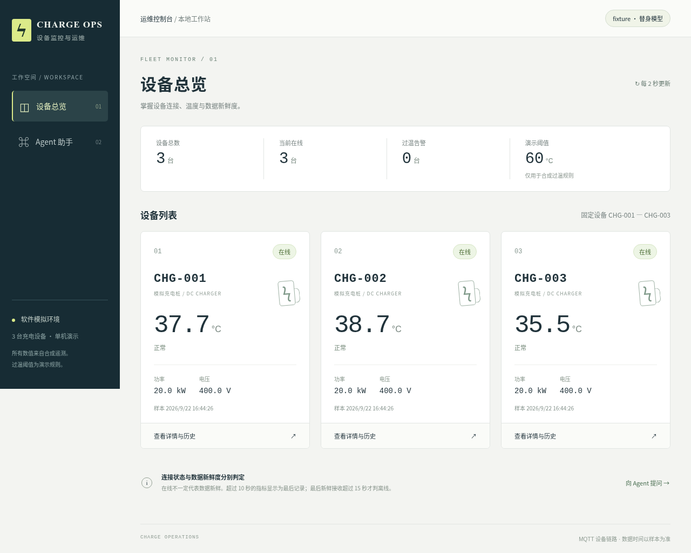

# 充电设备监控与运维 Agent

三台独立 MQTT 软件设备、FastAPI 单体、SQLite 七表、Vue 三页，以及一个通过四个函数工具查询设备和创建检修工单的业务 Agent。

已实现设备链路、场景回执、历史查询、工单证据与幂等、Agent 预算和三页交互。默认 `fixture` 为确定性模型替身，不能作为真实模型效果。当前 G1/G2 工程验收通过，G3 尚未通过：真实评测遇到模型端点超时，人工复核未完成。详细状态见 [PROGRESS](docs/PROGRESS.md) 和 [AC 证据索引](artifacts/acceptance/results.json)。



## 环境与启动

Linux/WSL2 + Docker Compose，源码与 SQLite 位于 Linux 本地文件系统。需要 uv 和 Node.js ≥22.12。本项目锁定 Python 3.12；首次 `uv sync` 会按需准备解释器。已验证的工具版本与依赖见 [设计记录](docs/decisions.md)、`uv.lock`、`frontend/package-lock.json`。

```bash
# 从仓库根目录；已有配置不覆盖
[ -e .env ] || cp .env.example .env
uv sync --locked
npm --prefix frontend ci
npm --prefix frontend exec -- playwright install chromium
# 仅当浏览器缺少系统库时，由管理员准备：
# npm --prefix frontend exec -- playwright install-deps chromium

docker compose --env-file .env -f deploy/compose.yaml up -d --build
```

打开 **http://127.0.0.1:8080**。只绑定本机端口：前端 8080、后端 8000、MQTT 1883。`/api/health` 返回 DB/MQTT 依赖状态与模型模式；依赖未就绪为 503。界面用中文文字显示 online/offline、unknown、过温与数据过期。

容器数据库位于 backend 独立卷；本机调试使用 `data/charge_ops.db`，二者不共用。关闭演示服务使用 `docker compose --env-file .env -f deploy/compose.yaml down`，不带 `-v` 保留数据。不要用删除开发库来运行测试。

## 本机开发

先启动自己的 Broker（或仅启动 Compose mqtt 服务），再运行：

```bash
uv run uvicorn backend.app.main:create_app --factory --host 127.0.0.1 --port 8000 --workers 1
npm --prefix frontend run dev
```

前端开发代理 `/api` 到 127.0.0.1:8000。生产页面由 nginx 同源代理后端。首次空库会自动初始化三设备，不需要手动补表；可选的 `uv run python scripts/seed_demo.py --profile demo` 只初始化空库，不重置现有数据。

## 操作闭环

1. 总览查看三台设备与样本时间，进入 CHG-002 详情。
2. 点击“模拟过温”，等待匹配回执和新样本；发布成功不会提前显示 applied。
3. Agent 中查询状态或分析历史。未勾选授权时不暴露写工具，服务器仍会再次检查。
4. 需要建单时开始新任务，勾选授权并明确提出建单要求。工单必须基于本任务、本设备的有效只读证据。
5. 刷新恢复原 run；网络提交失败可复用原 request_id 重试。新任务再次建同设备同原因工单，复用已有 OPEN 编号。
6. “暂停上报”保留控制订阅。数据超过 10 秒先过期，最后新鲜接收超过 15 秒才离线；恢复 normal 后用新样本确认在线。

## 自动化验证

测试拥有独立临时 SQLite、Compose 项目、卷、随机端口、MQTT 前缀与客户端 ID，只清理自身资源。同源代码测试可复用只读镜像缓存，不复用业务数据。E2E 的空数据和失败环境使用独立实例；超时替身仅存在于 `tests/support/failure_app.py`，不能进入正常 real 路径。

```bash
uv run pytest tests/unit tests/integration -q --junitxml=artifacts/acceptance/backend.xml
npm --prefix frontend run typecheck
npm --prefix frontend run build
npm --prefix frontend run test:e2e

# 每次用新目录，避免覆盖失败证据
ACCEPTANCE_STAMP=$(date -u +%Y%m%dT%H%M%SZ)
uv run python scripts/acceptance.py --suite core --output "artifacts/acceptance/core-$ACCEPTANCE_STAMP"
uv run python scripts/acceptance.py --suite performance --output "artifacts/acceptance/performance-$ACCEPTANCE_STAMP"
uv run python scripts/acceptance.py --suite resilience --output "artifacts/acceptance/resilience-$ACCEPTANCE_STAMP"
```

`core` 执行后端契约测试和独立四服务冷启动，并按 AC 编号列出自动化子项；页面与人工子项在总索引中单独合并。`performance` 真实运行 60 分钟，保持浏览器打开，按 PUBACK ID 与历史样本核对接收率，读取事务返回后的提交日志计算延迟，然后预热 50 次、10 并发发送 1000 次本地查询。不能缩短时长后仍称通过。

`resilience` 执行重启/依赖恢复与 Agent 中断测试，并运行 60 分钟稳态检查。若已有相容的完整性能证据，可传 `--reuse-performance <原始证据目录>`，报告保留原始摘要与来源；必须说明版本相容性，不能拿旧数据掩盖行为变更。仅复测查询可运行 `uv run python scripts/query_performance.py --output <新目录>`（三设备 60 分钟预置数据）；汇总时用 `--query-evidence <查询目录>` 独立引用新样本，保留原失败。当前沿用依据见 `artifacts/acceptance/performance-compatibility.json`。

自定义入口退出码：0=通过，1=验收失败，2=环境阻塞，3=待人工复核。pytest/npm 保留自身退出码。尚未覆盖的 AC 子项仍为 NOT_RUN；测试数量不是验收通过率。若外网下载不可用，可显式设置 `CHARGE_TEST_DEPENDENCY_IMAGE=<已有测试镜像>`；工具先核对 uv.lock/pyproject 完全相同，再复制当前源码、离线安装，不能复用旧业务数据。

## 真实模型与评测

只在本机 `.env` 配置 `LLM_BASE_URL`（Chat Completions 的 `/v1` 基地址）、`LLM_MODEL`、`LLM_API_KEY`。运行真实演示再将 `LLM_MODE` 改为 `real` 并重建后端。密钥只给后端，不填写在命令行、聊天、前端构建或证据中。

真实适配器没有隐藏重试和 fixture 回退。本机代理的 `deepseek-v4-flash` 已通过真实工具调用往返及 Docker 页面查询验证；这不代表任意兼容端点都可用，也不替代完整 60 次效果评测。缺配置会明确报错。独立评测使用相同 create_app、真实 API/工具和每例临时库，在 lifespan 启动后加载固定夹具，只冻结数据时钟。

```bash
ACCEPTANCE_STAMP=$(date -u +%Y%m%dT%H%M%SZ)
# 首次配置端点先验证真实工具往返；不替代60案例评测
uv run python eval/run.py --mode real --smoke --output "artifacts/acceptance/model-smoke-$ACCEPTANCE_STAMP"
uv run python eval/run.py --mode real --repeat 3 --output "artifacts/acceptance/real-$ACCEPTANCE_STAMP"
uv run python eval/run.py --summarize "artifacts/acceptance/real-$ACCEPTANCE_STAMP" --review-file eval/manual-review.json
```

如果模型地址是宿主机的 `127.0.0.1`，容器无法直接使用该回环地址。通常先使用服务商的可访问 API 地址；对于必须保留本机回环监听的模型代理，本项目提供可选的宿主机转发脚本。当前代理使用 8317 端口，Docker 私有网桥监听 18317：

```bash
# 已存在默认 deploy Compose 网络；此进程在宿主机运行，保持终端打开
MODEL_BRIDGE_IP=$(docker network inspect deploy_default --format '{{(index .IPAM.Config 0).Gateway}}')
uv run python scripts/local_model_bridge.py --listen-host "$MODEL_BRIDGE_IP" --listen-port 18317 --target-port 8317
```

本地 `.env` 中保留原 `LLM_BASE_URL` 给宿主机评测使用，另将 `LLM_DOCKER_BASE_URL` 设为 `http://<上面的网桥 IP>:18317/v1`，并设置 `LLM_MODE=real`。随后运行 `docker compose --env-file .env -f deploy/compose.yaml up -d --no-build --no-deps --wait backend` 重新加载配置。桥接不读取密钥、不记录传输内容，只连接固定的本机回环端口；不要使用 0.0.0.0 监听。Ctrl+C 可关闭前台桥接；关闭后真实模型请求会明确失败，设备采集继续运行。

本次后台桥接的 PID/日志位于忽略提交的 `data/local-model-bridge.pid` 和 `data/local-model-bridge.log`。WSL 或主机重启后需重新启动；Compose 网络重建后应重新确认网桥 IP。以后换成可直接访问的服务商 API 时，清空 `LLM_DOCKER_BASE_URL`，让容器使用 `LLM_BASE_URL`。

20 个案例各执行 3 次，包含案例内部的幂等前置步骤。机器检查工具参数、证据与数据库结果；人工逐例检查答案语义和关键错误。运行后输出 review-template.json，复制到 eval/manual-review.json 后逐项填写实际 reviewer、reviewed_at、success 和 critical_errors，保持 evidence_sha256 与原始证据一致。没有真实人工评审时保持 PENDING_REVIEW，不自动填写 reviewer。若提示词、模型、Schema 或工单逻辑改变，应为最终版本重新完整评测。

## 说明与边界

- [开发计划](docs/AI_IoT_Agent_开发计划.md) / [验收合同](docs/AI_IoT_Agent_验收规则.md)
- [架构](docs/architecture.md) / [设计取舍](docs/decisions.md) / [已知限制](docs/known-limitations.md)
- [3—5 分钟演示脚本](docs/demo.md) / [求职表述草案](docs/career-notes.md)

温度阈值和设备数据均为合成演示。未实现实体硬件、模型训练、MCP、向量 RAG、多 Agent 或电路控制。思想参考 EMQX [sdv-mcp-demo](https://github.com/emqx/sdv-mcp-demo)，本仓库的遥测可靠性、工单、前端与测试为另行实现，没有复制该示例代码。第三方依赖遵循各自许可；原创仓库尚未授予外部开源许可。
