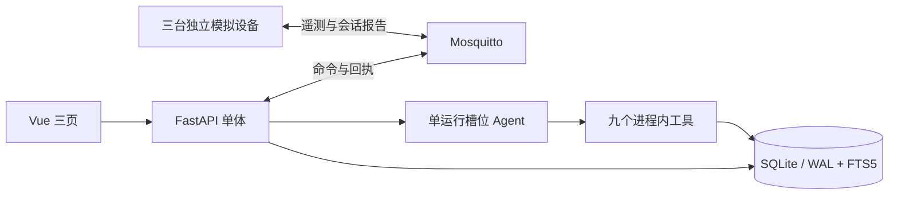

# 充电设备监控与运维 Agent

一个面向校招展示的单机物联网应用：三台软件充电桩通过 MQTT 上报数据，FastAPI 保存业务状态，Vue 页面展示设备、会话与工单；一个运维 Agent 使用受限工具查询证据并回答问题。设备启停和功率调整由用户在页面发起，Agent 不能直接控制设备。

**当前状态：**v2.0 功能已实现，综合验收 V2-T11 仍在进行。既有自动化记录和 132 次真实模型案例的程序检查不等于真人语义复核；M4 尚未判定通过。具体范围与限制见 [开发进度](docs/PROGRESS.md)和[已知限制](docs/known-limitations.md)。

`artifacts/` 用于本地测试、备份和验收产物，已从当前 Git 树移除并被忽略；旧提交仍可能包含原文件。当前版本不提供原始验收报告或截图；文档中的历史数字应按对应版本与原始记录核对，不能当作本次拉取后新运行的结果。

## 可以演示什么

| 模块 | 当前能力 |
|---|---|
| 软件设备 | CHG-001～003 三个独立 MQTT 客户端；正常、过温、暂停上报场景及匹配回执 |
| 充电运营 | 软件会话与整数 Wh 计量、站点功率预览及先降后升执行、确认与未知结果区分 |
| 告警与工单 | 持续异常检测、确认和恢复；工单处理、验证关闭及未关闭工单防重复 |
| 运维 Agent | 八个只读工具和一个需本次明确授权的建单工具；单运行槽位、工具轨迹与证据引用 |
| 三个页面 | 设备总览、设备详情、Agent 对话；展示曲线、会话、告警、工单、巡检与事件时间线 |

知识检索使用本地 SQLite FTS5 和 24 篇项目自写的模拟系统资料。它不是厂商维修手册，也不是向量 RAG。`fixture` 模式用于演示工程链路，不代表真实模型的回答质量。

## 快速启动

需要 Linux/WSL2 和 Docker Compose；源码与 SQLite 应放在 Linux 本地文件系统。首次启动需要下载构建镜像。仓库根目录执行：

```bash
[ -e .env ] || cp .env.example .env
# 新演示在 .env 中保持 SIMULATOR_MODE=operations；已有 .env 不会被覆盖
docker compose --env-file .env -f deploy/compose.yaml up -d --build --wait
```

打开 <http://127.0.0.1:8080>。后端健康检查为 <http://127.0.0.1:8000/api/health>；MQTT、后端、前端默认分别发布在本机 `1883`、`8000`、`8080` 端口。四个 Compose 服务是 `mqtt`、`backend`、`simulator`、`frontend`，宿主机端口只绑定 `127.0.0.1`。如果端口被占用，可在 `.env` 中设置 `MQTT_PUBLISH_PORT`、`BACKEND_PUBLISH_PORT`、`FRONTEND_PUBLISH_PORT`。

```bash
# 停止服务并保留数据库与模拟器状态卷
docker compose --env-file .env -f deploy/compose.yaml down
```

Compose 的 SQLite 数据库与模拟器检查点分别使用独立卷。宿主机调试使用 `data/`，不要让宿主机进程与容器同时写同一个数据库或检查点目录。`operations` 模式初始为空闲、0 W；`legacy` 模式用于旧遥测协议回归，不适合演示充电会话。

## 一条演示路线

1. 在设备详情启动软件充电会话；启动后的功率限制仍为 0 W。
2. 回到总览，预览并执行站点功率计划，等待设备新鲜遥测确认实际限制。部分成功或未确认结果不会显示为全部生效。
3. 对 CHG-002 模拟过温，观察新样本与告警。告警“确认”只表示已查看，不表示故障恢复。
4. 运行只读巡检，查看三台设备的事实快照、工具轨迹及知识来源。
5. 在 Agent 页开始新任务，明确提出建单要求并勾选本次授权；查看数据库返回的真实工单编号。
6. 恢复正常场景，待新鲜样本和告警恢复后，在详情页处理并验证关闭工单；用事件时间线复盘。

完整讲解顺序见 [3—5 分钟演示脚本](docs/demo.md)。设备温度、功率和故障都是软件合成数据，不用于真实充电设备的安全控制。

## 架构与约束



遥测的“在线”和“数据新鲜”独立判断：样本年龄不超过 10 秒才可称新鲜，最后一次新鲜接收超过 15 秒才离线。旧样本可留在历史，但不能让设备重新在线。控制命令发布、设备回执及新遥测效果分别记录；未知结果不冒充成功。更多实现和事务边界见 [架构说明](docs/architecture.md)。

## 开发与验证

本机开发使用 Python 3.12、[uv](https://docs.astral.sh/uv/) 和 Node.js ≥22.12。依赖版本由 `uv.lock` 与 `frontend/package-lock.json` 锁定：

```bash
uv sync --locked
npm --prefix frontend ci
npm --prefix frontend exec -- playwright install chromium
```

先用 Compose 单独启动 `mqtt`，然后在不同终端启动后端、模拟器与前端：

```bash
docker compose --env-file .env -f deploy/compose.yaml up -d mqtt
uv run uvicorn backend.app.main:create_app --factory --host 127.0.0.1 --port 8000 --workers 1
uv run python -m simulator.main
npm --prefix frontend run dev
```

日常验证命令如下；浏览器测试会创建并清理自己的隔离 Compose 资源，不使用演示数据库：

```bash
uv run pytest tests/unit tests/integration -q --junitxml=artifacts/acceptance/backend.xml
npm --prefix frontend run typecheck
npm --prefix frontend run build
npm --prefix frontend run test:e2e
```

阶段验收和性能入口在 [v2 验收方案](docs/AI_IoT_Agent_v2.0_验收方案.md)中定义。每次运行都应指定新的 `artifacts/acceptance/...` 输出目录，保留失败样本；完整稳定性测量需要 60 分钟，短时诊断不能代替它。产物在本地被 Git 忽略，需要自行备份。测试退出 0 只证明相应自动化范围，不能替代人工复核。

### 旧库升级

已有宿主机数据库升级前，先停止所有写入进程。迁移脚本执行编号 SQL 并校验摘要；备份与恢复必须使用新路径，不能覆盖原库：

```bash
BACKUP_DIR="artifacts/backups/v2-$(date -u +%Y%m%dT%H%M%SZ)"
uv run python scripts/migrate.py --check --database data/charge_ops.db
uv run python scripts/migrate.py --apply --database data/charge_ops.db --backup-dir "$BACKUP_DIR"
# 需要回退时，恢复到尚不存在的新文件
uv run python scripts/migrate.py --restore "$BACKUP_DIR/database.sqlite3" --destination data/restored-v1.db
```

容器卷中的数据库应在停止所属服务后取一致副本，再按同样方式在新路径验证升级；不要直接对运行中的演示卷操作。

## 模型模式与评测

`.env.example` 默认 `LLM_MODE=fixture`。切换真实模型时，在本机 `.env` 设置 `LLM_MODE=real`、`LLM_BASE_URL`、`LLM_MODEL`、`LLM_API_KEY`，然后重建后端容器：

```bash
docker compose --env-file .env -f deploy/compose.yaml up -d --no-build --no-deps --force-recreate --wait backend
```

真实模式只支持已验证的 Chat Completions 工具调用适配，不会在失败时暗中切换到 `fixture`。模型凭据只进入后端；不要提交 `.env` 或将密钥写入日志和测试产物。若模型服务只监听宿主机回环地址，容器不能直接使用该地址；可配置容器可达的 `LLM_DOCKER_BASE_URL`，或查看 [本机转发脚本](scripts/local_model_bridge.py) 的帮助。网页刷新会恢复原运行记录，更新模型后请在 Agent 页开始新任务。

原 A01—A20 和新增 B01—B24 各重复三次，共 132 次案例执行；程序核对工具、引用和数据库，真人逐例核对回答语义及关键错误。当前真人结论仍待填写。运行入口为 `eval/run.py`、`eval/run_v2.py`，评审方法见 [真实模型复核说明](docs/real-model-review.md)。不要把案例次数当作模型请求次数，也不要将 `fixture` 成绩写成真实模型效果。

## 文档与边界

- [v2 开发方案](docs/AI_IoT_Agent_v2.0_开发方案.md) · [v2 验收方案](docs/AI_IoT_Agent_v2.0_验收方案.md) · [开发进度](docs/PROGRESS.md)
- [架构](docs/architecture.md) · [设计取舍](docs/decisions.md) · [已知限制](docs/known-limitations.md)
- [演示脚本](docs/demo.md) · [第三方来源](docs/third-party-notices.md)

本项目是单机、单用户演示，没有实体硬件联锁、面向公网的鉴权、多租户、支付、模型训练、MCP 或向量数据库。构思参考 EMQX 的 [sdv-mcp-demo](https://github.com/emqx/sdv-mcp-demo)；本仓库的设备链路与业务代码另行实现，没有实现 MCP over MQTT。原创仓库目前未授予外部开源许可。
