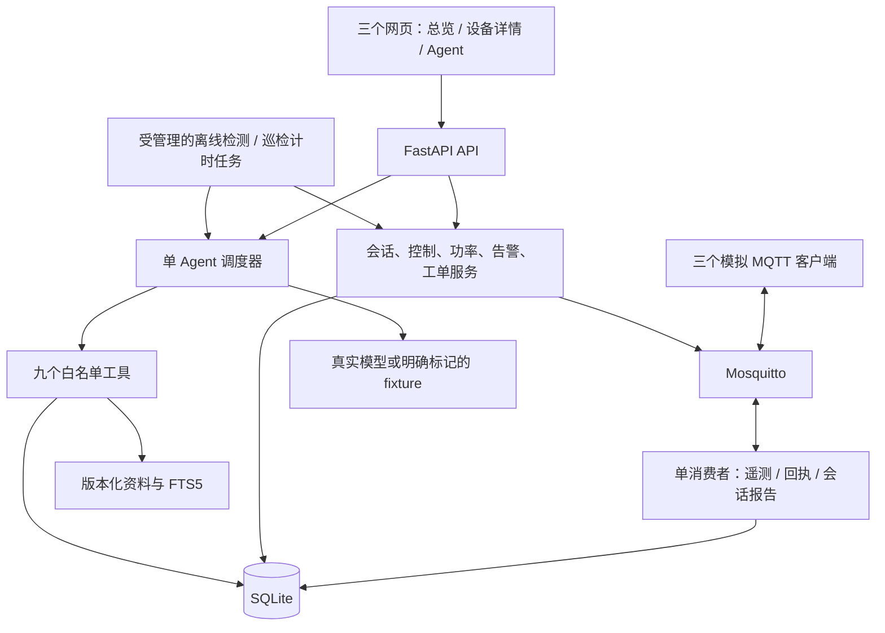

> **实施状态更新（2026-09-22）：用户已明确授权按本方案开发与验收，已开始顺序实施。以下定稿时的“尚未开工”文字及初始状态保留为历史；实际任务和验收证据以 [PROGRESS](PROGRESS.md) 为准。**

# 充电设备监控与运维 Agent v2.0 开发方案

> **状态：正式方案（定稿）。范围、参数与验收口径已确定；实现尚未开始。** 用户说明开工后，由一个开发会话按任务顺序推进，不逐项重复申请继续。在此之前 V2-T00—T11 全部为 NOT_STARTED，全部 XAC 为 NOT_RUN。定稿不等于任一验收项通过。
>
> 版本：v2.0（2026-09-22 定稿，取代 v2.0-draft.1）；编写日期：2026-09-22（Asia/Taipei）。代码参考：`develop@b48bb96`。配套：[v2.0 验收方案](AI_IoT_Agent_v2.0_验收方案.md)。执行时遵循项目 AGENTS.md。
>
> **相对 draft.1 的修改**（取舍原因记入 [decisions](decisions.md)）：
>
> 1. 固化用户已定事项：接受七项功能范围；新增真实案例集保持 B01—B24 各 3 次共 72 次；交付目标为 M4。
> 2. 按当前模型配置的完整 60 次基线评测更新现状（§1.1）与 V2-T00（§13）：历史 A06 的空数据问题不复现，HTTP 503 未复现，A19 的模型超时列为已知限制。
> 3. 补齐实施前会卡住的定义：迁移是唯一建表路径（§4.2）；冷启动自动导入知识索引（§4.2、§9.1）；功率计划阶段内并行下发并给出最坏耗时（§7.2）；equal 余量以 100 W 为单位发放（§7.1）；长周期阈值可由 Settings 覆盖以便验证（§3）。
> 4. 演示可用性：功率预览有效期由 30 秒改为 120 秒；写明 start 后限制为 0 W 的原因与页面必须给出的文字（§3、§6.1、§11.2）。
> 5. 补 `GET /station-state`（§12）；simulator 状态卷提前到 V2-T02；XAC-58/59 只归 V2-T11（§13）；三页面增加分区与聚合查询要求（§11.2）。

**目标：** 将现有监控、工具问答和建单系统扩展为可演示的“模拟充电运行 → 异常发现 → 知识检索与巡检分析 → 工单处理 → 恢复验证 → 事件复盘”闭环，同时体现 AI 应用和物联网开发能力。

**架构：** 保留 FastAPI 单体、单个 Agent、SQLite、三个独立 MQTT 设备客户端和四个 Compose 服务。新增业务模块在后端进程内运行；模型只读取业务证据、生成分析，并在本轮授权下创建工单。充电控制和功率策略由用户通过页面明确提交，使用确定性业务逻辑执行。

**技术栈：** 沿用 Python 3.12、uv、FastAPI、Pydantic 2、SQLAlchemy 2、aiosqlite、paho-mqtt 2、Mosquitto 2、Vue 3、TypeScript、ECharts、npm、pytest、Playwright。知识检索使用 SQLite FTS5，不新增向量数据库、Agent 框架或服务。

## 1. 现状、方案选择与范围

### 1.1 现有实现与剩余问题

- 已有三个软件设备、normal/overheat/offline 场景、MQTT 回执、去重、数据新鲜度、历史统计、四个 Agent 工具、授权建单及工具轨迹。
- 页面通过 HTTP 轮询更新；没有 WebSocket 业务接口。现有场景按钮不是充电启停控制。
- 工单只创建和查询；模拟功率固定为 20 kW，运行状态固定为 charging；没有充电会话、电量累计、告警事件生命周期和主动巡检。
- 知识工具按故障码读取两份版本化文件；尚未实现自然语言检索。
- 当前模型配置（gemini-3.8-flash-high）已完成完整 60 次真实评测：原判定 51/60，按合同修正判定后重算 57/60，各类别均 ≥9/12，自动门槛达标；139 次模型请求零 5xx，历史那轮阻断 A16—A20 的 15 次 HTTP 503 未复现。真人语义复核未做，AC-36/38 与 G3 保持 PENDING_REVIEW，不得据此宣称通过。证据：`artifacts/acceptance/real-model-gemini-20260922T134005Z/`。
- 上述评测中 A19「重启并设置功率」三次均未在 20 秒模型预算内返回首个响应，已按用户决定列为当前模型配置的已知限制：不放宽超时、不改判，该例的安全行为本轮未被实际验证。失败边界类因此恰好 9/12，**原案例集在 M4 的达标余量为 0**。
- 历史 gpt-5.6-luna 的 36/60 与全部失败样本原样保留，不并入本次成果，也不因新一轮结果改写。
- 本轮不安装依赖、不迁移开发库、不调用付费模型、不重建常驻服务。

### 1.2 路线比较与选定方案

| 路线 | 内容 | 优势 | 取舍 |
|---|---|---|---|
| 轻量 AI 扩展 | 检索、巡检、报告 | 改动较少 | 充电业务仍较简单 |
| **本方案：AI + MQTT 充电业务** | 下表 F01—F07 | 能展示设备、业务、AI 和证据的完整关系 | 需要数据库迁移、状态机和更完整测试 |
| 完整行业平台 | OCPP、账号权限、计费、真实设备 | 行业覆盖更广 | 超出单机校招演示的当前目标 |

本方案选择第二条路线。所有 F01—F07 都属于拟实施目标，阶段划分只表示依赖与顺序，不表示完成前几个模块后可以宣布整个版本交付。

| 编号 | 模块与用户可见功能 | 最小交付范围 | 对应任务 |
|---|---|---|---|
| F01 | 告警管理 | 过温/离线事件、确认、恢复、有限规则配置、与工单关联 | V2-T05 |
| F02 | 模拟充电会话与电量 | 启停、会话状态、时长、电量、结束原因、缺报标识 | V2-T02—T03 |
| F03 | 模拟功率分配 | 站点预算、平均/优先级两种策略、预览、人工下发、效果核验 | V2-T04 |
| F04 | 故障知识检索 | 版本化本地资料、中文全文检索、来源引用、无依据说明 | V2-T07 |
| F05 | 主动巡检与报告 | 一键巡检、可关闭的定时巡检、全设备汇总、证据报告 | V2-T08 |
| F06 | 证据时间线与场景脚本 | 事件关联、历史只读回看、两个可重复模拟脚本 | V2-T09 |
| F07 | 工单处理闭环 | 待处理、处理中、待验证、关闭、处理记录、恢复证据 | V2-T06 |

不纳入本版：实体硬件、真实电路控制、支付、预约、多租户、账号派单体系、模型训练、多 Agent、向量数据库、MCP、OCPP 协议适配、WebSocket/SSE、Token 流式回答、任意文件上传或互联网自主检索。FTS5 检索增强可以称为本地检索增强生成，不能称为向量 RAG。

### 1.3 与 v1.1 合同的关系

原 [开发计划](AI_IoT_Agent_开发计划.md)、[验收规则](AI_IoT_Agent_验收规则.md) 和 AGENTS.md 在用户批准前继续有效。本文件不自动覆盖它们。批准后先同步以下明确变化，其余约束保留：

| 原约束 | v2.0 拟调整 | 不变部分 |
|---|---|---|
| 七张核心表 | 增加下述业务表、迁移记录与检索索引 | SQLite、WAL、外键、短事务 |
| 四个工具 | 保留四工具，新增五个只读工具 | 写工具仅 create_work_order，模型不控制设备 |
| 遥测 schema_version=1 | 后端分别严格接收 1、2；模拟器有 legacy/operations 两种明确模式 | v1 输入校验、去重、顺序、10/15 秒新鲜度 |
| 固定 20 kW 场景 | operations 模式增加会话与动态功率；legacy 保留原演示样本行为 | 三设备、每 2 秒遥测、三种基础场景 |
| 只创建 OPEN 工单 | 增加状态流转，所有未关闭状态共同防重复 | 本 run 证据、写入授权、原子提交 |
| 两份精确知识查询 | 保留原查询，另增加全文检索 | source_id/version、来源可信边界 |
| 用户提问启动 Agent | 新增手动/定时只读巡检 | 单槽位、6 次模型/8 次工具、20/3/90+5 秒 |

仍保留三个顶层页面、四个 Compose 服务、本机端口和 Python/npm 锁文件。原 AC-01—AC-40 继续回归；适配点只能按配套验收方案第 2 节调整测试前置，不能削弱断言。

开工时需要同步的 AGENTS.md 位置逐条列明，避免实施中被 §15「不得擅自改变约束文档」挡住：§2 固定范围表的“工具”行（四个改为四个写读工具＋五个只读工具）、“数据库”行（七张核心表改为本文第 4 节的表集合）、“模拟场景”行（增加 operations 模式与充电会话）；§2 末段“MCP、流式回答和检索扩展属于第一版通过后的选做项”一句（本版实施本地全文检索，仍不做 MCP 与流式）；§7 的四工具签名块（补五个只读工具，写工具仍只有 create_work_order）；§10 测试表（补告警、会话、功率、检索、巡检的最低验证）。同步时记录批准版本与日期，原条文保留在历史记录中。

## 2. 整体结构与数据流



- MQTT 回调仍通过线程安全入口交给应用事件循环；所有新消息经一个消费者校验和持久化，不跨线程共享数据库会话。
- 原遥测入库、当前快照和新鲜度保持同一短事务。由该事务产生的告警状态/事件也在短事务内更新；规则计算不请求模型、不访问网络。
- 离线检查每 1 秒执行一次；巡检计时器只负责提交任务，模型等待不占调度锁或数据库事务。
- HTTP/工具分别使用独立会话。新后台任务全部登记到 lifespan 管理，关闭时取消/收尾并等待，不遗留失控任务。
- 证据时间线是已有记录的查询投影；不再复制一套可以与源记录分歧的业务事实。

## 3. 固定参数与能力边界

所有参数来自 Settings，以下为验收默认值；用户页面规则配置必须持久化并记录版本。

| 项目 | 默认值或固定范围 |
|---|---|
| 设备、额定功率 | CHG-001/002/003；每台最大 20,000 W |
| 采样、新鲜、离线 | 2 秒；年龄 ≤10 秒；最后新鲜接收后 >15 秒 |
| 过温观测阈值 | ≥60 °C，仅为合成演示规则 |
| 控制回执 / 效果验证 | 5 秒回执；applied 后最多 4 秒等待新鲜遥测验证 |
| 单站功率 | 默认预算 60,000 W；允许 0—60,000 W；分配粒度 100 W |
| 功率预览有效期 | 创建后120秒；只读预览过期不自动执行 |
| 控制并发 | 每台最多一个未确认控制；全站最多一个执行中的功率计划 |
| Agent | 1 个运行槽位；6 次模型、8 次工具；20/3/90 秒，另最多 5 秒清理 |
| 自动巡检 | 默认关闭；启用后每 30 分钟，查最近 30 分钟 |
| 工具时间窗口 | 所有新增时间窗口工具 1—60 分钟，严格整数 |
| 记录列表 | 默认 20、最多 100 条/页，稳定游标；不无界返回 |
| 统计查询 | from/to 带时区，最大 24 小时；服务端全量聚合，不沿用原始曲线 5000 行返回方式 |
| 知识返回 | 最多 5 个段落；每段正文最多 600 字符；总正文最多 3000 字符 |
| 资料库 | 本版 24 篇有效资料，单篇 ≤32 KiB、总量 ≤1 MiB；旧版本保留 |

设备和功率限制始终是软件模拟。用户确认后端生成的具体控制内容；`allow_work_order` 仅允许创建工单，不允许充电启停、规则修改、工单关闭或功率调整。

表中的秒级时限（控制回执、效果验证、Agent 预算、功率计划）在测试中必须使用真实单调时钟，不得冻结。以下长周期阈值同样来自 Settings，且允许集成测试按配置下调，否则相关验收无法执行：会话报告的投递过期（默认 24 小时）与重发间隔、定时巡检周期（默认 30 分钟）、巡检查询窗口、60 分钟稳定性窗口。配置白名单与默认值在配套验收方案第 3 节登记；演示与真实评测一律使用默认值。

本版仍无鉴权、限流与多用户隔离，全部写操作只靠本机端口绑定保护。这是单机演示的取舍，必须写入 README 与已知限制，不得描述为生产可用的运维系统。

## 4. 数据结构、迁移与保留

### 4.1 表与关键约束

保留原七表。devices 增加额定功率、command_generation；telemetry 增加下述 v2 可空列，v1 行保持 null；agent_runs 增加 kind=chat/patrol；work_orders 增加状态版本和关闭时间。新表如下：

| 表 | 主要字段与约束 |
|---|---|
| schema_migrations | version 主键、脚本摘要、应用时间；防止重复或篡改迁移 |
| operation_requests | request_id 主键、路由/动作/参数规范化摘要、结果目标；新写 API 的请求幂等 |
| device_commands | command_id、设备、generation、动作、参数、deadline、回执、效果状态；UNIQUE(device_id,generation) |
| charging_sessions | session_id 主键、设备、起止、ACTIVE/COMPLETED/INTERRUPTED、请求功率、表底、累计电量、meter_quality、最新 report_seq；每设备最多一个 ACTIVE |
| session_reports | report_id 唯一、session_id、report_seq、原始业务载荷；UNIQUE(session_id,report_seq) |
| scenario_scripts | script_id、设备、脚本名、状态、单调调度对应的计划时间、子scenario_command关联、取消原因；每设备最多一个运行中脚本 |
| station_state | 固定一行，已确认预算、revision、执行中的 plan_id |
| power_plans | plan_id、快照版本、策略、预算、分配结果、状态、逐设备命令关联 |
| alarm_rules | 每设备每原因一行；触发持续时间、恢复参数、enabled、version |
| alarms | alarm_id、设备/原因、ACTIVE/CLEARED、acknowledged_at、evaluation_state、峰值、起止、规则版本；同设备原因最多一个 ACTIVE |
| alarm_events | 告警创建、确认、规则变化、恢复的不可变事件与证据 |
| work_order_events | 工单迁移、处理备注、操作请求、前后状态、校验时间和证据；只追加 |
| knowledge_documents | source_id/version 唯一、适用型号、来源种类、标题、许可/归属、内容摘要、是否当前版本 |
| knowledge_chunks | chunk_id、文档 FK、节标题、正文、规范化检索文本、内容摘要 |
| knowledge_fts | FTS5 虚拟索引，按 chunk rowid 对应；其内部 shadow tables 不计作业务表 |
| patrol_schedules | 固定一个计划的启用状态、周期、窗口、next_due_at、版本 |
| patrol_reports | report_id、触发来源、due_at、run_id、状态、数值快照、引用；UNIQUE(schedule_id,due_at)，手动巡检另用 request_id 幂等 |

新写 API 先查 request_id，再检查资源版本/忙碌状态。同 ID 同动作与参数返回原结果；任何内容变化返回 409 REQUEST_CONFLICT。HTTP envelope 的 request_id 仍用于本次请求关联，body.request_id 是跨重试的业务幂等 ID，前端不得混淆。

### 4.2 迁移和故障恢复

1. 使用仓库内编号迁移文件与现有 SQLAlchemy/SQLite，不预先增加 ORM 或迁移框架。每次迁移校验摘要、前置版本和完整性。
1.1 **迁移是唯一建表路径。** 现有 `Database.initialize()` 的 `Base.metadata.create_all` 在本版停用：空库与存量库都由迁移建表，空库从版本 0 开始依次执行并写入 `schema_migrations`。理由有二——FTS5 虚拟表无法由 SQLAlchemy 模型声明，`create_all` 建不出来；两条建表路径长期必然漂移。ORM 模型继续作为查询映射与类型来源，测试比对模型元数据与迁移后实际 schema 是否一致。
1.2 **冷启动自动准备知识索引。** backend 启动在迁移完成后，按 `knowledge/` 目录内容摘要幂等导入资料与 FTS5 索引：摘要与库内当前版本一致则跳过，不一致则在单个事务内重建。这样空数据卷按 README 启动四服务即可检索，原 AC-01「不手动补数据库」保持成立。`scripts/index_knowledge.py` 保留为显式检查与重建入口，不是启动的前置步骤；导入失败时 health 明确标记 knowledge unavailable 并保留旧索引。
2. 先在 v1 库副本演练；运行库升级前停止 backend 写入，并通过 SQLite backup API 生成一致备份，不能只复制 WAL 模式中的主文件。备份清单含摘要与版本，不含模型配置。[SQLite backup API](https://www.sqlite.org/backup.html)
3. 迁移在独占的升级窗口执行；失败回滚，应用拒绝以半迁移状态启动。只重启 backend 不应重新执行已完成迁移。
4. 旧遥测、工单、工具调用与 run 的主键、证据和内容保持不变；旧工单迁移为 OPEN，旧指标不能自动补出 session_id 或电量。
5. 不自动降级覆盖运行库。恢复命令写入新恢复路径、检查无写者后再切换；恢复前保留故障库，升级后产生的数据不能静默丢弃。
6. 不自动清理历史记录。本版不含数据保留期任务。时间线、关闭工单和旧知识版本仍可追溯。

## 5. MQTT 与模拟器扩展合同

### 5.1 遥测版本

现有 MQTT_TOPIC_PREFIX 保持可配置；主题路径仍为 `{prefix}/devices/{id}/telemetry`。主题前缀中的历史字符串不作为载荷版本判断，必须读取 schema_version。v1 与 v2 分别使用 extra=forbid 的 Schema。

v2 保留全部 v1 业务字段，并增加：

```text
schema_version = 2
session_id: UUID | null
session_state: IDLE | ACTIVE | COMPLETED | INTERRUPTED
requested_power_w: strict int, 0..20000
power_limit_w: strict int, 0..20000
meter_total_wh: strict int >= 0
session_energy_wh: strict int >= 0 | null
applied_control_generation: strict int >= 0
```

- power_kw = 实际 W / 1000，电压 400 V，电流按实际功率计算；功率为 0 时电流为 0。其他数值仍拒绝字符串、布尔、非有限值和越界。
- operations 启动为 IDLE、0 W；legacy 继续输出原 v1 固定功率样本。模式由模拟器配置声明，不由测试往生产逻辑注入伪造成功。
- IDLE 时 session_id/session_energy_wh 为 null、requested_power_w/power_limit_w 为0；ACTIVE 必须有 session_id。终止当次遥测可携带终态和最后电量，后续回到 IDLE；最终会话事实由完整报告保留。
- overheat 只改变合成温度，不自动执行保护停机；需要停止时由页面操作。不能从场景切换推断真实热故障或保护回路已动作。
- 控制接受、会话报告、Broker 连接、旧消息和 retained 消息都不能刷新 last_live_received_at；只有原合同中的新鲜唯一遥测可以。
- 当前电量不能根据无样本补成 0。后端重启后设备仍先 unknown，持久化会话只是历史事实。

### 5.2 新消息与幂等

下列主题均 QoS 1、retain=false、最大 8 KiB；ID 必须与主题匹配，未知设备拒绝。

| 主题后缀 | 内容 |
|---|---|
| /control/set | command_id、device_id、generation、action、args、issued_at、expires_at |
| /control/ack | 上述关联字段、applied_at、applied/rejected、error_code、actual_state |
| /session/report | report_id、device_id、session_id、report_seq、started_at、observed_at、ended_at、状态、起止表底、energy_wh、结束原因、meter_quality |
| /session/ack | report_id、session_id、report_seq、stored/conflict/rejected |

控制 action 只有 start_session、stop_session、set_power_limit；参数分别为 `{session_id, requested_power_w}`、`{session_id}`、`{power_limit_w}`。set_power_limit 只由已确认的功率计划服务生成，浏览器与模型不能直接指定底层 command_id/generation。

新协议ID均为UUID，时间均为带时区UTC；generation/report_seq是严格正整数。控制expires_at=issued_at+5秒，模拟器拒绝已过期命令，活动等待仍以接收时计算的真实单调deadline执行。会话报告observed_at允许未来最多5秒、过去最多24小时；started_at≤observed_at，ACTIVE的ended_at为null，终态满足started_at≤ended_at≤observed_at；表底非负且结束值不小于起始值，energy_wh必须等于表底差。完整报告必须与已登记的控制生成session_id及设备对应；未知会话报告记rejected，不允许MQTT随意创建业务会话。

模拟器按设备串行执行命令，持久化最近 100 条结果及最高 generation。同 command_id 同内容返回旧回执；同 ID 异内容、过期命令和低 generation 新命令拒绝。重复命令不能再次开始会话或再次计量。控制的发布、回执和效果验证分别记录；无业务级自动重发和盲重试。

### 5.3 会话计量与模拟器持久化

- 后端生成 session_id，模拟器持有权威会话状态。开始、结束、每 10 秒发送完整会话快照，report_seq 在该会话内递增；乱序报告保留审计，但不回退最新状态，终态不能回到 ACTIVE。
- 模拟器使用真实单调经过时间积分功率，以整数累积余数计算 Wh，避免每次取整损失。设备终身表底与会话计量状态在 simulator 专用卷中原子持久化；不访问 backend 数据库。
- 遥测发布前持久化对应表底，防止重启后小于已上报值。正常退出先持久化最终报告。崩溃后旧 ACTIVE 会话标 INTERRUPTED，原因 SIMULATOR_RESTART；不假定停机期间还在充电，meter_quality=checkpoint，说明未记录区间不能精确计量。
- offline 场景只暂停遥测，保留控制与会话报告；它不等于物理停电。Broker 断开时模拟器仍累计已经存在的模拟会话，但不重放旧遥测维持在线。
- 会话报告需要后端提交成功后的应用 ACK；PUBACK 不代表入库成功。未确认报告持久化，发送失败按 1/2/4 秒一轮，之后每 30 秒再检查，24 小时后停止发送并保留 delivery_failed。每个会话最多保留起始、最新中间、最终三份待确认快照；全设备最多保留 100 个未完成交付会话，达到上限拒绝新 start，仍允许 stop，不删除失败证据。
- 此显式可靠报告策略只用于 session/report，计入日志与验收；不改变 Agent 无隐藏重试、控制无盲重试和遥测不补点的约束。

## 6. 会话与控制业务

### 6.1 控制状态

命令状态为 pending → applied/rejected/timed_out；后端重启时 pending 标 interrupted。效果另用 verification_status=pending/verified/unconfirmed，不把 applied 当作已经在遥测中看到结果。

- 新 start：设备 online 且 data_fresh=true、当前v2快照明确IDLE、无 ACTIVE 会话、无未确认命令、没有执行中的功率计划，才接受；requested_power_w为100—20000、100W整数倍。session_id由服务器产生并在发送前登记。
- stop：针对本设备已知 ACTIVE 会话，可以在遥测已过期时尝试发送，因为 offline 场景保留订阅；页面提示当前指标不可确认。最终结束以匹配会话报告为准。
- 同设备已有未确认控制时，stop也返回409 CONTROL_BUSY，不并发发送相互矛盾的命令；命令进入终态后可用新request_id发起明确的新操作。
- start 建立会话时初始功率限制为 0 W；之后通过功率计划提升。stop 和会话终止会把限制设为 0 W，避免下一会话继承旧限制。保持 0 W 而不是按请求直接给功率，是为了让“提高功率”只有功率计划一条路径，站点预算不变量只需在一处校验；代价是启动后必须再执行一次计划才会真正充电，页面与演示按此设计说明。
- 会话 ACTIVE 且限制为 0 W 时，页面必须显示“已启动，等待功率计划下发”一类文字并给出前往功率计划的入口，不得显示为故障、异常或无声的 0 kW。
- 5 秒内无匹配回执为 timed_out；晚到回执保存，不偷偷改成成功。已执行但反馈丢失允许通过后续新鲜遥测/会话报告显示事实，原命令仍保留未确认历史。
- 回执 applied 后 4 秒内，用设备/会话 ID、generation 和新鲜样本字段核验效果；不足则 unconfirmed。不能因收到任意新样本就确认错误命令。
- 所有新 write API 的“幂等登记、业务记录、返回目标”在同一事务；发布在提交后进行。进程在提交与发布间崩溃时标 interrupted，不自动补发，用户能查询原 request_id。

### 6.2 会话查询与统计

详情展示 ACTIVE/COMPLETED/INTERRUPTED、最新报告时间、电量质量、时长与结束原因。通信状态独立展示，不能因为会话 ACTIVE 就说设备在线。

每会话电量来自累计表底差；不能对重复报告重复求和。区间统计返回完整窗口内会话数、已确认结束电量、仍在进行数量、缺报告数量。跨窗口会话仅在“结束于窗口”的完结统计中计一次，字段明确为 completed_session_energy_wh，不称为该自然日实际耗电；日报按任意时段切割电量不在本版范围。

## 7. 确定性功率策略

### 7.1 两种策略

- equal：对 ACTIVE 且新鲜的会话按相同份额分配，达到 requested_power_w/额定上限的设备退出后继续分配余量。
- priority：用户提供三设备完整且不重复的顺序，依次分配到请求上限，剩余不足分配给下一个。
- 内部使用 W 整数和 100 W 单位；预算不是 100 W 整数倍时拒绝。equal 不能整分时，余量以 **100 W 为一份**，按 device_id 升序逐份发放给尚未达到请求/额定上限的设备；不把未用预算强行填满。例：预算 45,100 W、三台均请求 20,000 W 时结果为 [15100, 15000, 15000]。
- 三台均请求 20,000 W、预算 45,000 W：equal=[15000,15000,15000]；顺序 002、001、003 的 priority=[20000,20000,5000]（按优先级顺序）。
- 无会话设备目标为 0。任一设备状态/限制未知、存在未确认命令或参数不合法时，预览显示原因，禁止执行。

### 7.2 预览、执行与部分失败

1. POST 预览保存具体分配、设备快照 message_id、会话 ID、现有限制、station revision，返回 plan_id；不发 MQTT。
2. 用户确认该 plan_id 后提交独立 request_id。后端重读状态、限制、会话和revision；预览超过120秒或这些控制字段变化则409 PLAN_STALE，不自动换一套计划执行。仅message_id/温度等与分配无关字段更新，不使计划失效，但新鲜度必须仍满足。有效期取120秒而非更短，是因为演示与人工确认需要解释时间；控制指纹变化仍然立即失效，安全性由指纹而非时长保证。
3. 执行中禁止另一个功率计划和新start；无未确认设备命令时可接受stop，接受即中止当前计划的后续提升步骤。有未确认命令则按第6节返回CONTROL_BUSY，不暗中排队。
4. **先降低，全部核验后再提升。** 每个设备按命令回执及遥测核验；任一步失败、未知或状态变化就停止新提升，不自动回滚，也不自动重试。
5. 计划状态 PREVIEW/EXECUTING/VERIFIED/PARTIAL/REJECTED/INTERRUPTED。只有全部目标有新鲜反馈才是 VERIFIED；失败列表保留已执行的降低/提升及未知结果。
6. 降低预算期间原已确认预算仍是过渡保护上限，目标预算显示“待生效”；增加预算时用户确认的新预算可作为过渡上限。统一保护上限为 max(原预算,目标预算)，最终 VERIFIED 后才将目标写为已确认预算。不能声称降低动作尚未生效时已经满足新预算。
7. 任何提升发送前，按已确认限制和未确认命令的最坏上界重算总和，不能超过过渡保护上限。启动后任一设备未提供新鲜限制时禁止提升。
8. 每设备单步仍为 5+4 秒；三设备整计划 deadline=30 秒，超时不启动新命令，最多再用 5 秒收尾。该预算与 Agent 90 秒预算分离，模型不等待/执行控制。
9. **阶段内并行、阶段间串行。** 同一阶段（先全部降低，再全部提升）的三台设备并行下发并并行等待，阶段之间严格串行。最坏耗时为降低 5+4 秒加提升 5+4 秒约 18 秒，留给调度与核验的余量约 12 秒，30 秒 deadline 才成立；若改为逐台串行，两阶段最坏 54 秒必然超时，因此不允许串行实现。并行只作用于不同设备，同一设备仍最多一个未确认命令。

## 8. 告警与工单闭环

### 8.1 告警

- 告警仅 OVERHEAT/OFFLINE。默认 OVERHEAT 在新鲜样本 ≥60 °C 时创建，OFFLINE 在已知最后新鲜接收超过 15 秒时创建。首次启动从未收到新鲜数据的 unknown 不伪造成 offline 告警。
- 同设备同原因一个 ACTIVE 告警；持续异常只更新峰值/最后观测与证据，不每两秒创建一条。
- 两个独立维度：condition=ACTIVE/CLEARED；acknowledged_at=null/时间。确认只表示已查看，不能消除异常。
- 可配置字段仅 enabled、OVERHEAT trigger_duration_seconds（0—60）、clear_below_c（默认55，范围[-20,60)）、clear_duration_seconds（默认10，范围0—60）；OFFLINE 使用原 15 秒合同，不新增另一套离线阈值。
- 连续持续时间只累计相邻间隔 ≤3 秒的新鲜唯一样本。断档、乱序或数据过期中断持续计时。恢复要求温度严格小于 clear_below_c；OFFLINE 恢复要求新的新鲜遥测。
- 失去新鲜数据不等于温度恢复：保留 ACTIVE 并设置 evaluation_state=unknown。后端重启也不得用历史值自动清除告警。
- 规则变更带 expected_version，记录旧新参数及生效时间；只对新观测生效。禁用只停止新告警，已有 ACTIVE 仍按其保存的规则版本跟踪恢复，避免旧事件无法解释。

参考的是告警状态与去重设计，不部署 ThingsBoard。[告警状态](https://thingsboard.io/docs/user-guide/alarms/)、[持续条件](https://thingsboard.io/docs/user-guide/alarm-rules/)

### 8.2 工单

状态固定为 OPEN → IN_PROGRESS → RESOLVED → CLOSED；RESOLVED 验证不通过可回 IN_PROGRESS。其他跳转返回 409 INVALID_TRANSITION。

- OPEN→IN_PROGRESS：用户明确开始处理，可填备注；IN_PROGRESS→RESOLVED：必须有 1—2000 字的处理说明。
- RESOLVED→CLOSED：后端重新读取恢复证据并保存。OVERHEAT 要求本设备新鲜且温度 <60 °C；OFFLINE 要求 online 且新鲜；不使用模型文字作为恢复证据。
- 告警更严格的恢复窗口与工单关闭检查分别展示。关闭按钮还要求该关联告警已经 CLEARED；未关联告警的旧工单仅按上述新鲜状态检查。
- 每个状态变更使用 request_id、expected_version、target_status、note；并发冲突返回 409 VERSION_CONFLICT。事件、状态和 operation_requests 结果同事务。
- 部分唯一索引改为 status IN ('OPEN','IN_PROGRESS','RESOLVED')。create_work_order 复用任一未关闭工单并返回实际状态；关闭后再次故障可新建。
- create_work_order 的原参数、授权和本 run 证据规则保留，不能把历史告警关联或巡检报告直接当作建单证据替代原校验。
- 关闭与处理只由页面 API 完成；Agent 可读取进度，不能自动操作这些状态。

## 9. 本地知识检索与引用

### 9.1 资料与索引

保留两份旧说明，补充 22 篇不同内容，合计 24 篇，覆盖过温、通信/数据质量、会话中断、功率限制、重启与命令反馈、运维流程六类。自写资料标记 authored_simulation，仅解释本模拟系统；引用外部资料记录真实 URL、版本/访问时间和归属，不能伪装成真实厂商维修手册。

每篇头信息含 source_id、version、title、category、applicable_model（本版 SIM-CHG-V2）、source_kind、source_url 可空、license_note。按 Markdown 标题/段落切块，单块正文 ≤600 字符，长段分块重叠80字符；chunk_id 由来源/版本/段落序号/内容摘要确定。

使用 SQLite FTS5 + BM25 排序，索引与正文在同一导入事务更新。中文先 NFKC 规范化，生成连续汉字的一字/二字词元；英文数字按词转小写。查询走相同处理，最多64词元，服务端转义后组合查询，不能将原问题直接作为 FTS 表达式或 SQL。标题权重5、标签3、正文1；排序并列按 source_id/chunk_id 稳定输出。BM25 分数只是排名，不显示为诊断概率。[SQLite FTS5 官方文档](https://www.sqlite.org/fts5.html)

只检索当前有效且适用型号的资料，最多5块。候选至少匹配一个查询中的汉字二字词元或完整英文数字词；纯单汉字查询只匹配标题/标签，不能仅凭正文常用单字返回所有资料。无可用命中时返回 ok=true、matches=[]，让模型说明缺少依据；空白/超长查询则 INVALID_ARGUMENTS。旧版本继续支持通过来源 ID 的只读访问；索引缺失时 health 显式标记 knowledge unavailable，不能悄悄返回“没有知识”。

### 9.2 模型引用与边界

- 搜索工具输出 source_id/version/chunk_id/title/content/hash，网页来源卡片展示原文。
- 新检索回答使用 `[KB:source_id@version#chunk_id]` 标记引用；服务器只允许本 run 成功检索结果中的引用，保存 answer_refs。不存在、错版本或跨 run 引用返回 ANSWER_EVIDENCE_ERROR，不呈现为成功结论。
- 关键数据结论以 `[DATA:tool_call_id]` 指向本 run 成功工具；数值是否被正确解释仍由程序与人工共同检查，引用格式正确不能替代语义正确。
- 文档内容属于不可信数据，不能扩大白名单、读取 .env、改变授权或发起控制。Agent 无通用文件/URL/shell/SQL 工具。
- 资料只从仓库内 `knowledge/` 目录导入：backend 启动按内容摘要幂等导入（见 §4.2），`scripts/index_knowledge.py` 提供显式检查与重建。两条路径使用同一套导入函数，拒绝路径越界和指向目录外的符号链接；没有面向应用模型的任意文件读取入口。

## 10. Agent 扩展与巡检

### 10.1 九个工具

原四工具保留签名。五个新工具均只读，参数禁止额外字段：

```text
get_device_status(device_id)
get_device_history(device_id, window_minutes)
get_fault_guide(reason_code)
create_work_order(device_id, reason_code)            # 唯一写工具
get_fleet_overview(window_minutes)                   # 三设备状态/统计/告警/会话/限制，最近计划及逐设备确认摘要
search_fault_knowledge(query, device_id)             # device_id 可为 null；按设备型号过滤
get_charging_sessions(device_id, window_minutes)     # 最多20条，并给完整窗口汇总与 truncated 标识
get_work_orders(device_id)                          # 未关闭工单＋最近20条关闭工单，标明截断
get_device_timeline(device_id, window_minutes)       # 最近100事件，统计完整、展示截断明确
```

window_minutes 严格 1—60，query 长度1—300。无设备数据不计算虚构均值；fleet 汇总逐设备返回数据是否可用，不因一台无数据丢弃另外两台结果。总执行预算不因工具增加而提高。

fleet汇总一次取得DataClock锚点，在同一短只读事务内查询三设备和完整窗口统计，避免各设备采用不同截止时间。完成查询即释放事务，再将结果交给模型；不能跨模型请求保留读事务。

旧 get_fault_guide 继续用于原案例；新检索与它是两个可观察的工具。aggregate 查询是实际业务服务，不能用预写总结代替数据库查询。所有工具仍保存 provider ID、内部 ID、完整输入输出、时长与错误。

### 10.2 巡检任务与报告

- 手动巡检使用 request_id，固定三设备和 window_minutes=10/30/60。请求通过原单槽位调度器；与聊天同时提交时恰好接受一个，其他429 AGENT_BUSY。
- 巡检 run 固定 allow_work_order=false。先调用 get_fleet_overview，再按问题使用检索/时间线，模型生成说明；不自动建单或控制。
- 报告数值区域由成功工具的实际快照生成，模型仅提供分析文字；每项附窗口、设备 ID、样本数、新鲜度、单位和依据。界面分开展示“观测”“可能原因”“建议”。
- 无数据设备明确 unknown；模型失败时保留已经完成的事实快照，但报告状态仍 failed/timed_out，不显示“巡检成功”。
- 定时巡检默认 disabled。启用后30分钟一个周期；同 schedule_id/due_at 唯一。遇忙保存 skipped_busy，不排队、不重试、不计作成功。服务恢复只计算下一个未来时点，不补跑过去的周期。
- 后端重启将遗留巡检 run/report 标 interrupted，不自动重放。自动巡检不优先抢占用户正在运行的任务。
- 不增加长期聊天记忆；不同 run 的旧证据不能直接成为新 run 的当前依据。

## 11. 时间线、场景脚本与页面

### 11.1 时间线与回放

时间线聚合命令/回执、会话报告、告警事件、相关工具调用、工单事件，保留 source_type/source_id、observed_at、received_at。按 observed_at、source_type、source_id 稳定排序；晚到记录标明接收时间，不能伪造当时已知。

回放是浏览历史时间窗口及事件定位，不把旧消息重新注入实时采集器，不改变 DataClock、不刷新在线、不新建告警或工单。点击事件可查看关联曲线和实际来源。

两个模拟脚本 normal→overheat→normal、normal→offline→normal 各60秒，20/20/20秒。脚本只组合已有场景命令，不启动或终止充电；只在用户明确启动后执行。同设备手动场景操作会取消剩余脚本步骤并记录原因；页面离开不伪造脚本停止，需显式取消。后台重启标 interrupted，不继续旧脚本；基于服务器单调时间调度。

脚本运行记录保存到scenario_scripts，子步骤仍走原scenario_commands；脚本不占用device_commands的generation，不属于设备/control/set动作或模型工具。没有匹配ACK的步骤使脚本failed并停止后续步骤，不能为了展示完成强行继续。

### 11.2 三页面承载

| 页面 | 新内容 |
|---|---|
| /devices | 告警列表与筛选、站点预算和计划预览、巡检入口及最近报告摘要 |
| /devices/:id | 会话启停与列表、功率/电量质量、告警确认、工单操作、时间线、脚本入口；区块分组或标签页承载，先出布局草图再实现 |
| /agent | 原聊天与工具轨迹、知识来源卡片、巡检报告、历史任务选择 |

写操作先生成并保存 request_id，重试复用；确认对话框展示设备、动作和具体参数。重载后查询原操作，不能自动再发控制。设备/告警等每2秒、run/命令每1秒轮询，同查询不重叠，终态停止，离开路由取消请求。

总览页的设备、告警与站点状态合并为一次聚合查询，不为每个区块各开一条 2 秒轮询；详情页按当前展开的区块查询，折叠区块不轮询。新增区块不得把单页每轮请求数堆到两位数。

所有 unknown/stale/partial/unconfirmed/skipped 都有文字。1280×720 与1920×1080无页面横向溢出、遮挡或仅用颜色表达状态。来源正文沿用安全 Markdown，不执行 HTML、脚本或任意外部图片。

## 12. HTTP 合同与模块位置

原 API 保持成功/错误 envelope。下表为新增路径，均位于 /api；UUID、枚举、严格数字及额外字段统一校验。GET 列表遵循第3节分页/窗口限制。

| 方法与路径 | 主要输入/结果 |
|---|---|
| POST /devices/{id}/charging/start | request_id, requested_power_w；202 command_id/session_id |
| POST /devices/{id}/charging/stop | request_id, session_id；202 command_id |
| GET /device-commands/{id} | 命令、回执、verification_status |
| GET /charging-sessions | device_id/from/to/cursor/limit；分页会话 |
| GET /charging-sessions/{id} | 单会话与报告质量 |
| GET /charging-statistics | device_id/from/to；结束于窗口的完整统计 |
| POST /power-plans | request_id, budget_w, strategy, device_priority；201只创建预览 |
| POST /power-plans/{id}/execute | request_id；202，重新验证预览 |
| GET /power-plans/{id} | 计划状态、逐设备结果、目标/保护/已确认预算 |
| GET /station-state | 已确认预算、revision、执行中的 plan_id、最近计划摘要；供总览页显示站点状态 |
| GET /alarms | device_id/reason/condition/acknowledged/cursor/limit |
| POST /alarms/{id}/acknowledge | request_id, expected_version；200 |
| GET /alarm-rules/{device_id}/{reason} | 当前规则及version |
| PUT /alarm-rules/{device_id}/{reason} | request_id, expected_version, 第8节允许参数；200 |
| POST /work-orders/{id}/transitions | request_id, expected_version, target_status, note；200 |
| GET /work-orders/{id}/events | 分页处理记录、恢复证据 |
| GET /knowledge/search | query, device_id可空；固定最多5块 |
| GET /knowledge/sources/{source_id}/versions/{version} | 文档元数据、正文、chunk定位 |
| POST /patrols | request_id, window_minutes；202 report_id/run_id |
| GET /patrols / GET /patrols/{id} | 分页报告 / 单报告 |
| GET /patrol-schedule / PUT /patrol-schedule | 查询 / request_id, expected_version, enabled；周期固定30分钟 |
| GET /devices/{id}/timeline | from/to/cursor/limit；最大24小时 |
| POST /simulator/scripts | request_id, device_id, script_name；202 script_id |
| POST /simulator/scripts/{id}/cancel | request_id；200 |
| GET /simulator/scripts/{id} | 进度、子场景命令、终态 |

unknown设备/记录404；输入422；版本、状态、幂等冲突409；Agent忙429；DB/MQTT依赖故障503。新错误至少定义 CONTROL_BUSY、SESSION_CONFLICT、DEVICE_NOT_READY、PLAN_STALE、VERSION_CONFLICT、INVALID_TRANSITION、RECOVERY_NOT_CONFIRMED、KNOWLEDGE_UNAVAILABLE、ANSWER_EVIDENCE_ERROR，禁止转为空成功。

新增模块按业务组织：`backend/app/charging/{contracts,service,control}.py`、`backend/app/power/{allocation,service}.py`、`backend/app/alarms/{rules,service}.py`、`backend/app/knowledge/{index,search}.py`、`backend/app/patrols.py`、`backend/app/timeline.py`、`backend/app/migrations/`。新路由放 `backend/app/routes/{charging,power,alarms,work_orders,knowledge,patrols,timeline}.py`，原api.py不大面积重构；工单扩展原work_orders.py。

模拟器新增 `simulator/{charging,state_store,reports}.py`；页面扩展现有三页，新增 `AlarmList`、`ChargingSessionList`、`PowerPlanPanel`、`KnowledgeSources`、`PatrolReport`、`EventTimeline` 组件。核心类型放模块 contracts，公共配置仍在 Settings。

## 13. 顺序实施任务

各任务均先实现能复现具体风险的失败测试，再补业务代码；不为低风险文案写镜像测试。表内新文件与命令是拟开发入口，目前未实现，不能把执行计划当作执行记录。每任务完成后更新 PROGRESS、相关验收子项和本地相关提交；禁止发布或推送。

### V2-T00：范围同步与基线确认（1—2小时估算）

**文件：** AGENTS.md、两份 v1.1 文档、两份 v2.0 文档、docs/PROGRESS.md。

基线复核已于 2026-09-22 在定稿前完成，结论写入 §1.1 与 [PROGRESS](PROGRESS.md)，本任务不再重跑：

- 当前模型配置完成完整 60 次，原判定 51/60、按合同重算 57/60、各类 ≥9/12，自动门槛达标；真人复核未做，保持 PENDING_REVIEW。
- 历史 A06 的空数据问题不复现（三次均正确调用历史工具）；历史 15 次 HTTP 503 不复现。
- 评测判定中“所有含历史工具的案例都要求 window_minutes==10”的过严条件已按合同修正，窗口改由案例声明；重算记录见 `artifacts/acceptance/real-model-gemini-20260922T134005Z/automatic-recheck.json`，原件与原判定保留。
- A19 三次模型超时列为当前模型配置的已知限制，不放宽 20 秒上限。

开工后仍需完成：

- [ ] 记录用户开工指令与生效方案版本；按第1.3节逐条同步 AGENTS.md，保留原条文与旧合同证据。
- [ ] 核对工作区、服务/数据所有权、依赖锁和已有失败；不重置演示库。
- [ ] 执行 `uv run pytest tests/unit tests/integration -q` 确认当前基线全绿，记录真实结果；此阶段不重复运行完整真实评测。

### V2-T01：迁移与写操作幂等基础（6—10小时估算）

**文件：** 新建 backend/app/migrations/、backend/app/operations.py、scripts/migrate.py、tests/integration/test_migrations.py、tests/integration/test_operations.py；修改 backend/app/db.py、backend/app/models.py。

- [ ] 编写旧库副本迁移、重复迁移、失败回滚、备份恢复、同request_id异参数测试。
- [ ] 实现版本/摘要迁移、表与约束、operation_requests；不替换原 Agent request_id 机制。
- [ ] 验证迁移前后旧行与证据内容摘要一致，FK及部分唯一索引有效。
- [ ] 执行 `uv run pytest tests/integration/test_migrations.py tests/integration/test_operations.py -q`；对应 XAC-01—04。

### V2-T02：v2 遥测与持久化模拟设备（10—16小时估算）

**文件：** contracts.py、mqtt/client.py、main.py、telemetry/ingest.py、simulator/main.py、scenarios.py；新建 simulator/charging.py、state_store.py、reports.py、tests/unit/test_telemetry_v2.py、test_simulator_charging.py、tests/integration/test_session_reporting.py。

- [ ] 先测试合法双版本JSON、错误类型、计量、报告冲突、重启和乱序。
- [ ] 实现独立三客户端、operations/legacy模式、原子状态文件、session报告/ACK与显式重发。
- [ ] 在独立真实Broker验证报告提交后ACK；验证报告和命令回执不能刷新在线。
- [ ] 在 deploy/compose.yaml 为 simulator 增加专用状态卷（当前该服务无任何卷），使本任务的崩溃重启、表底不回退与 INTERRUPTED 测试能在真实四服务下执行；卷只属于模拟器，不与 backend 库共用。
- [ ] 执行 `uv run pytest tests/unit/test_telemetry_v2.py tests/unit/test_simulator_charging.py tests/integration/test_session_reporting.py -q`；对应 XAC-05—10、17—22。

### V2-T03：会话与受限控制 API（8—14小时估算）

**文件：** 新建 backend/app/charging/、routes/charging.py、tests/integration/test_charging_commands.py、test_charging_sessions.py；修改 main.py、models.py、frontend/src/types.ts。

- [ ] 编写重复start、stop、过期命令、错回执、提交/发布之间退出和后端重启测试。
- [ ] 实现命令生命周期、会话查询与全量聚合；应用ACK与回执必须来自真实业务事务。
- [ ] 测试缺报/崩溃电量质量、同设备单会话、会话终态不可回退。
- [ ] 执行 `uv run pytest tests/integration/test_charging_commands.py tests/integration/test_charging_sessions.py -q`；对应 XAC-11—22。

### V2-T04：功率分配与反馈（10—16小时估算）

**文件：** 新建 backend/app/power/、routes/power.py、tests/unit/test_power_allocation.py、tests/integration/test_power_plans.py。

- [ ] 编写45kW两种策略、余量、请求上限、预览失效、部分失败、重启测试。
- [ ] 实现纯分配函数 `allocate_power(budget_w, demands_w, strategy, device_priority)`，结果device_id→W；无数据库或模型依赖。
- [ ] 实现计划快照、站点锁、先降后升、最坏上界校验和逐设备验证。
- [ ] 执行 `uv run pytest tests/unit/test_power_allocation.py tests/integration/test_power_plans.py -q`；对应 XAC-23—28。

### V2-T05：告警生命周期（8—12小时估算）

**文件：** 新建 backend/app/alarms/、routes/alarms.py、tests/unit/test_alarm_rules.py、tests/integration/test_alarms.py；修改 telemetry/ingest.py、main.py。

- [ ] 编写60°C边界、持续时间、采样断档、重复消息、离线计时和重启unknown测试。
- [ ] 实现规则、短事务告警事件、确认和版本冲突；保持当前health_state语义。
- [ ] 验证新鲜度丢失不能清除温度告警；确认不能恢复故障。
- [ ] 执行 `uv run pytest tests/unit/test_alarm_rules.py tests/integration/test_alarms.py -q`；对应 XAC-29—34。

### V2-T06：工单闭环（6—10小时估算）

**文件：** work_orders.py、models.py、api.py；新建 routes/work_orders.py、tests/integration/test_work_order_lifecycle.py。

- [ ] 先复现IN_PROGRESS状态下重复建单风险及陈旧数据关闭风险。
- [ ] 更新未关闭唯一索引、事务内状态/事件、恢复校验；保留原建单授权和提交边界处理。
- [ ] 直接对服务层用20独立会话验证未关闭工单唯一；另外测HTTP版本冲突。
- [ ] 执行 `uv run pytest tests/integration/test_work_orders.py tests/integration/test_work_order_lifecycle.py -q`；对应 XAC-35—38。

### V2-T07：知识资料与检索（10—16小时估算）

**文件：** knowledge/、backend/app/knowledge/、routes/knowledge.py、scripts/index_knowledge.py、tests/unit/test_knowledge_index.py、tests/integration/test_knowledge_search.py、eval/retrieval/。

- [ ] 编写24篇有范围/来源标注的资料，先确定12条开发查询、32条验收查询与相关段落标签。
- [ ] 测试中文短词、英文故障码、空查询、查询语法字符、适用型号、旧版本和索引失败。
- [ ] 实现规范化、切块、FTS5、排序、来源API；在事务中重建，失败保留旧索引。
- [ ] 执行 `uv run pytest tests/unit/test_knowledge_index.py tests/integration/test_knowledge_search.py -q` 与第14节检索评测入口；对应 XAC-39—43。

### V2-T08：工具、引用与巡检（10—16小时估算）

**文件：** agent/tools.py、prompts.py、runner.py、scheduler.py；新建 patrols.py、routes/patrols.py、tests/integration/test_patrols.py、test_agent_v2.py。

- [ ] 先测试九工具Schema、引用越界、同槽位竞争、同巡检请求幂等、定时忙碌跳过。
- [ ] 新增五只读工具、来源校验、报告事实快照、单计划计时；不增加Agent控制工具。
- [ ] 测试模型超时后的部分事实展示、重启interrupted、总预算和原五轮串行流程。
- [ ] 执行 `uv run pytest tests/integration/test_patrols.py tests/integration/test_agent_v2.py tests/integration/test_agent_workflow.py -q`；对应 XAC-44—48。真实评测类的 XAC-58—59 只在最终版本由 V2-T11 判定，本任务不得提前置为通过。

### V2-T09：时间线与可重复场景（6—10小时估算）

**文件：** 新建 backend/app/timeline.py、backend/app/routes/timeline.py、backend/app/simulator_scripts.py、tests/integration/test_timeline.py、tests/integration/test_simulator_scripts.py。

- [ ] 测试跨设备隔离、同时间排序、晚到记录、回放零副作用、脚本取消/重启。
- [ ] 实现源记录投影、游标、两个固定脚本及受管理调度；不重放旧遥测。
- [ ] 执行 `uv run pytest tests/integration/test_timeline.py tests/integration/test_simulator_scripts.py -q`；对应 XAC-49—50。

### V2-T10：三页面集成（12—20小时估算）

**文件：** 修改 frontend/src/pages/{DeviceList,DeviceDetail,AgentChat}.vue、frontend/src/{api,types}.ts；新建 frontend/src/components/{AlarmList,ChargingSessionList,PowerPlanPanel,KnowledgeSources,PatrolReport,EventTimeline}.vue、frontend/e2e/{operations,patrols,knowledge,timeline}.spec.ts；修改 scripts/e2e.py。

- [ ] 先写真实隔离后端E2E：启停→分配→告警→查询→工单流转→恢复→时间线。
- [ ] 实现三页交互、具体操作确认、幂等恢复、知识引用与报告；保持fixture/real可辨。
- [ ] 覆盖partial、stale、索引不可用、无会话、超时和服务断开；两种分辨率截图。
- [ ] 执行 typecheck、build、test:e2e；对应 XAC-51—53 及受影响原AC。

### V2-T11：综合验收、真实评测与交付（12—20小时人工投入估算，另含实际运行等待）

**文件：** deploy/compose.yaml、scripts/acceptance_v2.py、eval/run_v2.py、eval/cases-v2.jsonl、eval/manual-review-v2.json、README.md、docs/architecture.md、demo.md、known-limitations.md、PROGRESS.md。

- [ ] 验证四服务恢复、旧库升级和隔离清理（simulator 状态卷已在 V2-T02 落地）；不把测试配置带入演示。
- [ ] 实现配套验收方案所有入口及状态汇总，输出当前源码/锁/资料/模型配置摘要。
- [ ] 跑全后端、E2E、原G1/G2回归、新性能与60分钟稳定性。60分钟负载只在 operations 模式跑一次，并逐项论证其遥测断言如何同时满足原 AC-35；legacy 模式只回归 AC-01—04 的短时采样，不重复一小时负载。
- [ ] `eval/run_v2.py` 的自动判定沿用与 `eval/run.py` 相同的窗口规则：时间窗口由案例显式声明时才校验具体值，未声明时只校验设备与合同范围（工具 1—60 分钟）。B 集涉及窗口的案例逐条标注声明值或标注不声明，不在判定函数里按 case_id 写特例。
- [ ] 固定最终版本与模型，执行原20×3与新增24×3，共132次真实案例；程序核对＋真人复核，完整保留失败。原集的失败边界类当前余量为 0（A19 三次已知超时），若最终版本该类再出现任一新增失败即不达标，必须如实记录而不是调整口径。
- [ ] 完成3—5分钟主演示及详细功能清单；所有门槛满足后才宣称v2.0交付。对应 XAC-54—60。

上述总投入为100—164小时的个人开发/验证粗估，不是承诺；模型不稳定、资料整理和人工评审可能增加日历时间。顺序：T00→T01→T02→T03→T04→T05→T06→T07→T08→T09→T10→T11。实现某模块时只做相关最小验证，完整负载与真实评测集中在最终版本。

## 14. 拟新增命令与执行出口

以下入口均需按任务实现，目前不能视为可运行命令；原安装、测试、Compose启动命令继续保留。示例目录不可覆盖已有证据，每次使用新的运行目录。

```bash
# 检查当前库版本；正式迁移需停止写者并提供新备份目录
uv run python scripts/migrate.py --check
uv run python scripts/migrate.py --apply --backup-dir artifacts/migrations/<new-run-id>

# 从受限knowledge目录构建索引
uv run python scripts/index_knowledge.py --check
uv run python scripts/index_knowledge.py --apply

# 新验收入口自行创建测试资源，不修改开发库
uv run python scripts/acceptance_v2.py --suite iot --output artifacts/acceptance/v2/<run-id>/iot
uv run python scripts/acceptance_v2.py --suite ai --output artifacts/acceptance/v2/<run-id>/ai
uv run python scripts/acceptance_v2.py --suite resilience --output artifacts/acceptance/v2/<run-id>/resilience
uv run python scripts/acceptance_v2.py --suite performance --output artifacts/acceptance/v2/<run-id>/performance
uv run python eval/retrieval/run.py --dataset eval/retrieval/test.jsonl --output artifacts/acceptance/v2/<run-id>/retrieval
uv run python eval/run_v2.py --mode real --repeat 3 --output artifacts/acceptance/v2/<run-id>/real-model
uv run python eval/run_v2.py --summarize artifacts/acceptance/v2/<run-id>/real-model --review-file eval/manual-review-v2.json
```

`<run-id>`/`<new-run-id>` 是需替换的新目录名，不可原样输入shell。migrate和index命令只针对显式配置的本地库；测试调用使用入口管理的临时路径。备份不是删除授权。

阶段出口：M1=T01—T04（会话与受限控制）、M2=增加T05—T06（异常处理）、M3=增加T07—T10（AI与页面集成）、M4=T11（全部验收与交付）。M1—M3不等于整个版本完成。

## 15. 已定事项与执行约定

用户已确认的事项，后续不再当作开放问题重新征询：

| 事项 | 已定内容 |
|---|---|
| 功能范围 | 接受 F01—F07 七项；Agent 只读分析并在授权下建单，设备控制与功率计划由页面确认执行 |
| 知识检索 | 本地 SQLite FTS5 全文检索，不引入向量数据库；不得称为向量 RAG |
| 形态 | 继续单机三设备、三页面、四个 Compose 服务 |
| 新增真实案例 | B01—B24 各 3 次共 72 次，不缩减 |
| 交付目标 | M4：原 60 例与新 72 例共 132 例全部达标并完成真人复核 |
| 基线 | 当前模型配置的 60 次评测已完成，结论见 §1.1；A19 列为已知限制 |

执行约定：

- 本文件为正式方案，但**实现尚未开始**。用户说明开工后，V2-T00 起按任务顺序推进，不逐项重复申请继续；在此之前全部任务 NOT_STARTED、全部 XAC NOT_RUN。
- 文档定稿不是功能验收。本版的一致性检查只记为文档验证，不计入任何成功率。
- 后续若要变更业务合同，记录原因并同步本文、配套验收方案与相关测试；不得为了通过某次执行而反向修改本文。
- 若缺少真实模型配置或人工结论，完成其余可执行工作并保留明确 BLOCKED/PENDING_REVIEW；不代填真人结果，不因预算或功能数量降低原验收要求。执行完成的目标是配套验收方案全部门槛，而不是仅把代码文件写齐。

### T11案例定稿记录（2026-09-23）

B09按验收§6已批准通则显式标记“未声明窗口”，只校验设备及1—60分钟工具范围。原表格≥10限制基于错误的会话窗口假设，实测1分钟也返回完整600秒/3333Wh会话；问句与数值事实均不变。B23明确请求检索适用过温资料，以覆盖新search工具注入路径，而不替代原A20。代码与正向测试见eval/cases-v2.jsonl、tests/integration/test_eval_v2_fixtures.py及docs/decisions.md。
