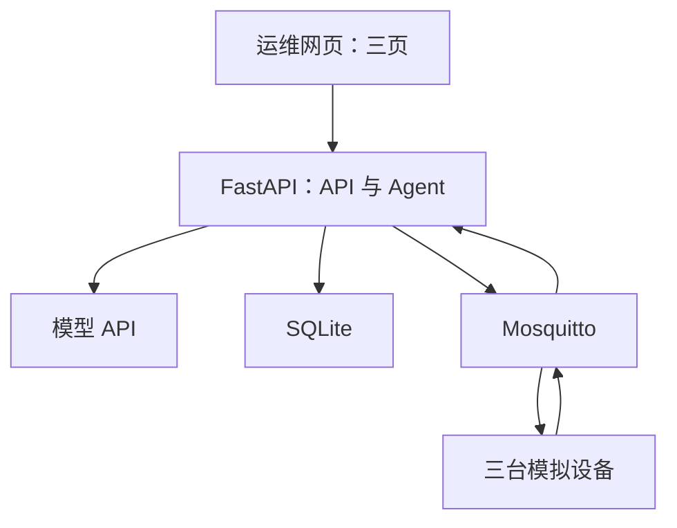

> 2026-09-22：用户已授权按 v2.0 正式开发/验收方案开工；范围变化以 v2.0 §1.3 为准，未调整的 v1.1 约束继续回归。以下历史正文保留。

# 充电设备监控与运维 Agent 开发计划

> 扩展方案：[v2.0 开发方案](AI_IoT_Agent_v2.0_开发方案.md)与[配套验收方案](AI_IoT_Agent_v2.0_验收方案.md)已于 2026-09-22 定稿为正式方案，实现尚未开始。开工并按其第 1.3 节同步约束前，本文 v1.1 基线继续有效。

> **For agentic workers:** 使用 `superpowers:executing-plans` 按任务顺序执行；若执行环境没有该技能，直接遵循本文的任务、接口和验收要求。每完成一项勾选复选框。默认由一个开发者或一个 Codex 会话顺序实现。

**Goal：** 为校招完成一个可以现场演示、能够解释关键实现、使用纯软件设备模拟的 AI Agent + 物联网全栈作品。

**Architecture：** 三台模拟充电桩经 MQTT 向单体后端发送遥测；后端将数据写入 SQLite，向三个网页提供查询接口。一个 Agent 通过四个业务工具查询设备、分析异常并创建检修工单；设备模拟器独立运行。

**Tech Stack：** Python 3.12、FastAPI、Pydantic 2、SQLAlchemy 2 + aiosqlite、paho-mqtt 2、Mosquitto 2、Vue 3、TypeScript、ECharts、SQLite、pytest、Playwright、Docker Compose。

**Spec：** 本文件第 1—6 节为随计划交付的设计基线；[AI_IoT_Agent_验收规则.md](AI_IoT_Agent_验收规则.md) 为对应验收合同。

**版本：** v1.1，2026-09-22，审阅修订版。**交付状态：** 设计与计划；尚未开发、运行或测量项目。

本次修订保留项目范围与九个任务，修正 Agent 请求预算、消息协议、证据归属、时间控制、评测隔离和启动约定。具体问题见 `AI_IoT_Agent_方案审阅与修改说明.md`（原引用文件未包含在本仓库，无法核验其内容；实际实施取舍见[设计记录](decisions.md)）。v1.1 是当前实施基线，旧版相冲突的约束不再适用。

## Global Constraints

- 纯软件模拟；固定三台设备 `CHG-001`、`CHG-002`、`CHG-003`。
- 一个 Agent、四个业务工具、三个业务页面；第一版使用函数调用。
- 遥测周期 2 秒；新鲜样本年龄不超过 10 秒；最后一次新鲜样本接收后超过 15 秒判离线。
- 温度达到 60 °C 触发演示用过温规则；该阈值是合成测试规则，不是实际充电设备标准。
- 后端一个 Uvicorn worker；SQLite 位于本地磁盘，开启 WAL、外键和 1000 ms busy timeout。
- 网页每 2 秒更新设备数据；Agent 运行状态每 1 秒查询一次。
- 单轮 Agent 最多 6 次模型请求、8 次工具执行；单次模型请求 20 秒、单次工具 3 秒、整轮 90 秒超时。总时限优先于单步时限。
- 同一设备同一原因最多存在一张 OPEN 工单；数据库约束负责最终去重。
- 本机演示为第一版部署范围；宿主机端口仅绑定 127.0.0.1。
- 模型密钥只保存在后端环境变量；使用真实模型的效果与使用替身模型的程序测试分开记录。
- 第一版不包含实体硬件、语音、真实支付、预约系统、多租户、微服务、自动控制充电电路、向量数据库或多 Agent。
- 代码、依赖、测试和性能证据必须可复现；禁止把本计划中的目标值写成已完成结果。

## Review Focus

1. 延迟、乱序、重复和 retained 遥测可能制造错误在线状态：任务 2、3 覆盖；对应验收 AC-05—AC-10。
2. 页面切换或重试导致重复建单：任务 5、7 覆盖；对应 AC-16—AC-19、AC-31。
3. 请求的设备、工具参数和工单证据不一致：任务 5、6 覆盖；对应 AC-20、AC-23、AC-25。
4. 模型或工具中断后仍显示成功：任务 6、7 覆盖；对应 AC-24、AC-27、AC-28、AC-32。
5. SQLite 锁竞争、Broker 重连和后端重启造成卡死或虚假在线：任务 3、8 覆盖；对应 AC-10、AC-34、AC-35。

---

## 1. 成果定义与范围

项目名称：**基于 AI Agent 的充电设备监控与运维系统**，仓库建议名 `charge-ops-agent`。

目标用户是演示环境中的单个运维人员。目标招聘方向是汽车相关企业的应用开发、物联网平台开发、AI 应用开发和全栈开发。

最小完整演示：启动三台模拟桩 → 查看实时数据 → 将 2 号桩切换为过温 → 向 Agent 提问 → 展示工具调用及数据依据 → 按用户授权创建工单 → 重复请求仍返回同一工单 → 恢复正常。

项目强调 MQTT 消息处理、数据新鲜度、工具调用和工程可靠性。模型使用已有 API，不训练模型。故障知识先使用两份带编号的本地说明，按故障码精确检索；简历应称为“工具化故障知识查询”，不要写成已经实现向量 RAG。

### 功能需求与任务映射

| 编号 | 必须交付的能力 | 任务 | 验收 |
|---|---|---|---|
| FR-01 | 三台独立 MQTT 客户端模拟设备 | 2 | AC-03、AC-04 |
| FR-02 | 数据校验、去重、乱序处理 | 3 | AC-05—AC-08 |
| FR-03 | 在线状态与数据新鲜度 | 3 | AC-09、AC-10 |
| FR-04 | 可恢复的模拟异常与回执 | 2、4 | AC-11—AC-13 |
| FR-05 | 当前状态与历史查询 | 4 | AC-14、AC-15 |
| FR-06 | 工单持久化、幂等和证据校验 | 5 | AC-16—AC-20 |
| FR-07 | 单 Agent 与四个工具 | 6 | AC-21—AC-26 |
| FR-08 | 超时、调用预算与错误展示 | 6、7 | AC-27、AC-28、AC-32 |
| FR-09 | 三页全栈演示与调用记录 | 7 | AC-29—AC-31 |
| FR-10 | 一键启动、恢复与正常负载稳定性 | 1、8 | AC-01、AC-02、AC-33—AC-35 |
| FR-11 | 真实模型效果评估 | 9 | AC-36—AC-38 |
| FR-12 | 说明、演示、证据和贡献边界 | 9 | AC-39、AC-40 |

### 可选加分项，第一版通过后选择一项

- 将已有四个函数包装成 MCP Server，不改变业务函数和测试合同。
- 给 Agent 回复增加流式显示。
- 扩充故障知识，并在固定评测集上比较不同检索方法。

以上均不计入第一版通过条件。

## 2. 架构与环境



后端在 FastAPI lifespan 中启动、停止 MQTT 连接及消费者。paho 网络回调将消息交给线程安全入口，再交由应用事件循环消费；不得跨线程共享数据库会话。一个任务负责遥测入库，每个 HTTP/工具事务使用独立 AsyncSession，写事务尽可能短。模型请求期间不得持有数据库事务或写锁。

SQLite 会话工厂必须对每个新连接应用外键和 1000 ms busy timeout；WAL 在初始化时启用并验证。写入忙时返回明确错误并记录，不增加无界重试。设备当前快照更新、样本写入和对应新鲜度更新在同一短事务完成。

区分两种时钟：`DataClock.now()` 返回带时区 UTC，供样本年龄、历史窗口和界面时间使用；`DeadlineClock.monotonic()` 使用事件循环单调时钟，供超时和耗时计算使用。评测只冻结 DataClock；deadline 不能跟着冻结。

全栈运行使用四个 Compose 服务：`mqtt`、`backend`、`simulator`、`frontend`。数据库只挂载到 `backend`。前端生产容器代理 `/api` 到后端，浏览器不直接连接 MQTT。HTTP 本地端口为 8080，后端本地调试端口为 8000，MQTT 本地调试端口为 1883。

开发建议 Windows + WSL2，源码和 SQLite 均放在 WSL Linux 文件系统。目标验证环境是 Docker 可用的 Linux/WSL2；不承诺 Windows 原生脚本全兼容。验收基准资源为至少 4 个逻辑 CPU、8 GB 可用内存、本地 SSD；实测报告必须记录实际环境。

用户已提供的电脑为 Ryzen 7 5800H、24 GB 内存。建议 WSL2 起步配置为 6 个逻辑处理器、12 GB 内存上限，整机 SSD 预留 30—40 GB。该配置是资源预算，不是已测占用；无需为这个项目更换架构。Codex、编辑器、浏览器和本项目可在同机使用，实际负载在任务 8 测量。

Python 使用 3.12 系列，前端构建使用 Node.js 22.12 或以上兼容版本。任务 1 选取相互兼容的稳定补丁版本，将 Python 依赖提交至 `uv.lock`、前端依赖提交至 `package-lock.json`，记录运行时与镜像版本。开发和验收均从同一锁文件安装，避免使用漂移的 `latest` 镜像。建议 `uv sync --locked` 与 `npm --prefix frontend ci`；第一次创建锁文件时正常解析依赖，后续安装才使用锁定模式。

根目录 pyproject.toml 将 `backend`、`simulator` 配置为可导入包；测试环境也需可导入共享夹具包 `tests.support`，补齐包入口，避免 eval/run.py 找不到夹具。测试依赖包含 pytest-asyncio 和 httpx，并配置异步测试模式。不要依赖开发者终端临时设置 PYTHONPATH 才能导入。Playwright 的 Chromium 与系统依赖由 README 给出安装命令，缺少浏览器时标 BLOCKED，不静默跳过 E2E。

### 第一版运行模式

| 模式 | 作用 | 能证明什么 |
|---|---|---|
| `LLM_MODE=fixture` | 替身模型按固定测试脚本返回 tool calls | 协议、业务、错误分支和界面运行正确 |
| `LLM_MODE=real` | 调用实际模型，工具结果来自当前系统 | 模型理解、工具选择和完整任务效果 |

界面必须显示当前模式。fixture 模式不能被称为真实 AI 成果；真实模式缺少密钥时返回明确错误，不能静默切换为 fixture。

Codex 是开发助手，项目中的模型 API 是应用运行依赖，二者分别配置。Codex 可以编写和执行工程代码；项目真实模型调用仍需用户在本机提供可用 API 凭据。第一版只适配一个已验证支持工具调用的 endpoint/model 组合；不承诺任意“兼容”端点开箱即用。任务 6 用一次最小“请求工具→回传结果→最终回复”调用验证协议后，记录脱敏配置。更多模型服务商属于后续扩展。

## 3. 数据与设备协议

### 3.1 MQTT 主题与传输

| 用途 | 主题 | QoS | retained |
|---|---|---|---|
| 遥测上报 | `charge/v1/devices/{device_id}/telemetry` | 1 | false |
| 模拟场景切换 | `charge/v1/devices/{device_id}/scenario/set` | 1 | false |
| 场景执行回执 | `charge/v1/devices/{device_id}/scenario/ack` | 1 | false |

这三个 MQTT 主题是普通应用协议，不是 MCP over MQTT。第一版的模型工具调用发生在后端进程内。后续增加 MCP 时应准确说明两者分工。

MQTT QoS 1 允许重复投递，业务必须幂等。演示不宣称跨全部故障实现严格 exactly-once。服务重启期间允许产生采集空窗，历史中显示空窗，不补造数据。

主题前缀由 MQTT_TOPIC_PREFIX 配置，默认 charge/v1；测试可替换为 charge-test/{test_run_id}/v1。模拟器、后端和测试订阅必须使用同一个前缀；每次测试使用独立 client_id。

### 3.2 遥测结构

```json
{
  "schema_version": 1,
  "device_id": "CHG-002",
  "message_id": "bb7ce354-0569-4bcb-82de-233380fbba31",
  "boot_id": "ee456e0c-cd91-4fe0-83f1-a63dfc076f6a",
  "seq": 17,
  "ts": "2026-09-22T08:00:00.000Z",
  "temperature_c": 71.0,
  "voltage_v": 400.0,
  "current_a": 50.0,
  "power_kw": 20.0,
  "operating_state": "charging"
}
```

- `message_id`、`boot_id` 为 UUID；`seq` 是一次模拟器启动内从 1 递增的正整数；重启生成新 boot_id。
- 设备 ID 必须与主题一致且存在于固定设备表。最大消息体 8 KiB。拒绝未知 schema_version。
- UTC 时间必须有时区；允许最多未来 5 秒；早于接收时刻 24 小时以上拒绝。
- 数字必须有限：温度 [-20,120] °C、电压 [0,1000] V、电流 [0,300] A、功率 [0,300] kW。拒绝 NaN、Infinity、数字字符串、布尔值冒充数值和额外字段。UUID 与时间字段按合法 JSON 字符串解析；不能把数值字段的 strict 规则误用成“所有 Python 字典字段只接受 UUID/datetime 对象”。正常 JSON 载荷必须有正向通过测试。
- 状态枚举 `idle | charging | fault`。电流、电压与功率在模拟器中满足 `power_kw = voltage_v * current_a / 1000`；数据库不承担真实电气模型校准。
- `received_at` 由后端产生，不能由设备传入。

### 3.3 顺序与新鲜度

1. `message_id` 全局唯一，`(device_id, boot_id, seq)` 也唯一。完全重复的有效消息只记一次；唯一键相同但内容不同的消息记冲突并丢弃，不覆盖原记录。
2. 合法的旧消息可以进入历史。设备当前快照只采用 `ts` 严格晚于已有快照的消息；相等时间戳不替换快照。
3. 只有“新的唯一消息、成为当前快照、接收时 `now - ts <= 10 秒`”才更新 `last_live_received_at`。极小的允许未来偏移按年龄 0 处理。
4. 重复消息、乱序旧消息、历史回放不能刷新在线状态。带 retained 标记的遥测直接忽略并计数。
5. 没有新鲜样本时状态为 `unknown`；有样本时，距 `last_live_received_at` 不超过 15 秒为 `online`，超过为 `offline`。健康状态和连接状态分开：过温桩可以同时是 online + overheat。
6. 后端重新启动后，设备在接收到本次进程的新鲜样本前显示 unknown；旧历史仍可查询。避免重启后误把持久化数据当作当前在线证据。

7. `data_fresh` 与 `connection_state` 独立返回：当前样本年龄不超过 10 秒且本进程已经收到新鲜样本时 data_fresh=true；超过为 false。存在 online 但 data_fresh=false 的 10—15 秒区间，此时界面和 Agent 必须标数据已过期。health_state 只有 data_fresh=true 时才为 normal/overheat；否则为 unknown，保留带时间的最后指标。
8. 比较消息内容时使用解析后的设备字段，不包含后端 received_at 或 committed_at。相同业务消息重传不能因接收时间改变而误判冲突。

### 3.4 三种模拟场景

| 场景 | 固定行为 | 数据用途 |
|---|---|---|
| normal | 每 2 秒产生 35—40 °C 的确定性数据，400 V、50 A、20 kW | 正常演示 |
| overheat | 每 2 秒产生 68—72 °C 数据，其余变量可保持正常 | 故障注入 |
| offline | 暂停遥测上报，保留控制订阅 | 展示失联判定与恢复 |

normal/overheat 使用固定 seed，使测试可复现。offline 是“遥测静默”模拟；真正网络断连另用停止 simulator 或重启 Broker 的测试覆盖。页面显示“已暂停上报，等待离线判定”，不能在按钮点击瞬间假装离线。

控制载荷为 `{command_id, device_id, scenario}`；回执为 `{command_id, device_id, scenario, applied_at, status}`，status 为 `applied | rejected`。模拟器缓存最近 100 个 command_id 的结果，重复指令返回同一回执。Broker 发布成功只代表消息交出，不能替代设备回执。5 秒未收到回执时命令转为 timed_out；晚到回执记录为 late_ack，不把已超时命令默默改成成功。超时代表执行结果未确认，并不证明设备未执行；用户通过新鲜遥测或新命令确认状态。

### 3.5 七张核心表

| 表 | 核心字段与约束 |
|---|---|
| `devices` | device_id PK、name、latest_telemetry_id；last_live_received_at 用于本进程在线判定，启动时清空 |
| `telemetry` | message_id UNIQUE、device_id FK、boot_id、seq、ts、received_at、四项数值、operating_state；UNIQUE(device_id,boot_id,seq)；索引(device_id,ts)；事务成功返回后按 message_id 记录 commit 完成时间到性能日志，不把写入前时间冒称 committed_at |
| `scenario_commands` | command_id PK、device_id、scenario、status、requested_at、ack_at、error、late_ack_json |
| `agent_runs` | run_id PK、request_id UNIQUE、request_hash、question、allow_work_order、status、answer、created_at、finished_at、error_code |
| `tool_calls` | tool_call_id PK（后端生成）、provider_call_id、run_id FK、tool_name、args_json、result_json、status、started_at、duration_ms、error_code；模型协议 ID 与内部记录 ID 分开保存 |
| `work_orders` | order_id PK、device_id、reason_code、status=OPEN、evidence_json、created_from_run_id、created_at；部分唯一索引(device_id,reason_code) WHERE status='OPEN' |
| `diagnostic_events` | id PK、event_type、device_id 可空、received_at、summary；记录拒收、重复、冲突、MQTT 连接与错误；禁止保存密钥 |

工单第一版只创建和查看；不扩展派单、审核、支付等生命周期。演示重置脚本可以清理测试库，默认命令不得清理真实工作目录。

## 4. HTTP 与工具合同

### 4.1 HTTP API

成功响应采用 `{data, request_id}`；失败采用 `{error:{code,message}, request_id}`。时间统一为带 Z 的 UTC ISO 8601。

| 方法与路径 | 请求 | 成功/失败规则 |
|---|---|---|
| GET `/api/health` | 无 | DB 与 MQTT 连接状态；全就绪 200，依赖未就绪 503；不返回密钥 |
| GET `/api/devices` | 无 | 固定三台，返回 connection_state、health_state、sample_ts、data_age_seconds、data_fresh |
| GET `/api/devices/{id}` | 无 | 当前快照和新鲜度；不存在 404 |
| GET `/api/devices/{id}/telemetry` | `from`、`to`，带时区，最多 24 小时 | 按 ts 升序；最多 5000 行；空区间 200 空数组；超过限制 422 |
| POST `/api/simulator/scenarios` | `{device_id,scenario}` | 202 返回 command_id；Broker 不可用 503；无效设备/场景 404/422 |
| GET `/api/simulator/commands/{id}` | 无 | pending/applied/rejected/timed_out 与回执内容 |
| POST `/api/agent/runs` | `{request_id,question,allow_work_order}` | 202 返回 run_id；同 request_id 同内容返回原 run_id；同 ID 不同内容 409 |
| GET `/api/agent/runs/{id}` | 无 | 当前状态、最终回答和工具日志；运行中不伪造最终结果 |
| GET `/api/work-orders` | 可选 device_id | 返回真实数据库工单 |

question 长度 1—2000 字符；request_id 是浏览器首次提交时生成的 UUID，网络重试必须复用。允许一个正在执行的 Agent run；新请求遇忙返回 429 `AGENT_BUSY`，不排无限队列。幂等请求查询先于忙碌检查。

“查幂等→检查槽位→插入 run→登记执行任务”在本进程调度锁保护下完成；数据库唯一约束处理最终冲突。异步等待模型不能持有此调度锁。先提交 run，再登记一个被生命周期管理的后台任务；若进程在两者之间退出，重启将该 queued run 标 interrupted。两个不同 request_id 同时到达也只能接受一个新任务。allow_work_order 缺省为 false；request_hash 由 UTF-8 规范化 JSON 的 question 和 allow_work_order 计算，已接受请求不得修改原载荷。

统一命名：对外使用 `sample_ts`，不再同时使用 last_sample_at；设备无任何样本时 temperature_c/sample_ts/data_age_seconds 为 null。FastAPI 的默认验证错误需映射到统一 error envelope，保留 422，不在前端解析另一套错误结构。

### 4.2 四个工具

统一工具结果为 `{tool_call_id,ok,data,error}`；tool_call_id 由后端生成并写入记录。失败不得使用“空数据成功”掩盖。未知设备用 `DEVICE_NOT_FOUND`，无数据用 `NO_DATA`，参数错误用 `INVALID_ARGUMENTS`。此封装同时写入 tool_calls.result_json 并作为模型可见工具结果，不由模型编写。

```python
async def get_device_status(device_id: str) -> dict: ...
async def get_device_history(device_id: str, window_minutes: int) -> dict: ...
async def get_fault_guide(reason_code: str) -> dict: ...
async def create_work_order(device_id: str, reason_code: str,
                            *, context: ToolContext) -> dict: ...
```

这里的函数声明用于固定接口，不是已完成的实现。`ToolContext` 包含服务器生成的 `run_id`、当前 `tool_call_id`、`allow_work_order`，由执行器注入，不能接受模型自行填写。模型侧 create_work_order 的 JSON Schema 仅暴露 device_id、reason_code；证据由后端查询当前 run 的成功只读工具记录自动关联，模型无需填写内部证据 ID。

- `get_device_status`：返回 connection_state、health_state、temperature_c 等最后指标、sample_ts、data_age_seconds、data_fresh。无新鲜数据时明确 stale/unknown，不能仅凭 online 就把旧指标称为实时值。
- `get_device_history`：window_minutes 为整数 1—60；返回样本数、开始/结束时间、温度 min/max/avg、过温样本数与超限区间。工具响应最多 100 条下采样点，统计计算使用完整窗口数据。没有样本返回 NO_DATA，不计算虚构平均数。
- `get_fault_guide`：只接受 `OVERHEAT | OFFLINE`；从 `knowledge/overheat.md`、`knowledge/offline.md` 精确读取，返回 source_id、version、标题和排查步骤。
- `create_work_order`：reason_code 只接受上述两个值；上下文必须允许写入。服务端按 run_id、device_id 查询成功的状态/历史工具记录并选择证据，不能使用别的 run 或设备的记录。OVERHEAT 需要“状态调用观测到过温，且写入时该样本仍新鲜”，或“本 run 历史调用确有写入时最近 60 分钟内的过温原始样本”；OFFLINE 需要本 run 状态工具曾确认 offline，并在写入前重算当前状态仍为 offline。证据不成立返回 INVALID_EVIDENCE；事务保存被选中的工具记录 ID、原始样本 ID/时间和校验时间。
- 同设备同原因已有 OPEN 工单时返回原 order_id 和 `created=false`；数据库唯一约束处理并发。模型输出不能自行指定 order_id。

### 4.3 工单授权与超时语义

对话框提供“允许本次创建检修工单”复选框，默认关闭。开启后才向本次模型提供写工具，并在服务器再检查一次。用户仅查询状态时不能暗中建单。此选项是用户对本次任务的业务选择，不是执行环境权限。

工单写入以数据库事务提交为准。创建/复用工单与当前 tool_call_id 的结果记录在同一事务提交，结果包含 order_id 和 created。若提交边界超时，先终止后续模型/工具调度，等待当前写事务完成或回滚，再依据当前 tool_call_id 的已提交结果恢复，不只按设备+原因猜测本次操作是否成功。这样可以区别本次新建与上次已有工单。

工具 3 秒和 Agent 90 秒时限限制业务执行；允许最多 5 秒的受管理清理时间用于取消请求、结束事务和恢复结果。退出清理后不得留下未追踪写任务。若 DB 无法访问导致结果无法确认，返回 WRITE_RESULT_UNKNOWN，界面显示结果未确认；禁止新工具、盲重试和成功声明。进程被杀死时 SQLite 的事务原子性保证“工单与调用结果同时存在或同时不存在”，重启按记录核对，不重放模型调用。

## 5. Agent 与证据规则

### 执行循环

1. 校验请求，在调度锁内查幂等、获得运行槽位并持久化 run。
2. 将问题、当前数据时钟、允许的工具 JSON Schema 发给模型；时间预算使用单调时钟。
3. 完整保存本次 assistant 响应，包括 provider tool call ID；把这条 assistant 消息先加入会话历史。
4. 在执行任何工具前验证整批工具的名称、参数及剩余预算；顺序执行合法工具，保存内部记录 ID 与 provider ID 映射。
5. 每个工具结果以对应的 provider tool call ID 回传，全部结果放在该 assistant 消息之后，再请求模型继续。
6. 模型输出最终回复后持久化；达到次数或时长上限时停止，保留已执行工具与真实工单结果。

```python
# 执行器结构约定；此处是算法说明，函数契约由任务 6 固定并测试。
for turn in range(6):
    response = await provider.complete(messages, exposed_tools, timeout_s=20)
    messages.append(response.to_assistant_message())
    if response.tool_calls:
        validate_entire_batch(response.tool_calls)
        enforce_total_tool_budget(limit=8, requested=len(response.tool_calls))
        for call in response.tool_calls:
            result = await executor.execute(call, context, timeout_s=3)
            messages.append(result.to_provider_message(tool_call_id=call.id))
    else:
        return finalize_with_evidence(response.text)
return fail_run("BUDGET_EXCEEDED")
```

外层使用 90 秒单调 deadline；每个 await 的实际 timeout 为“该单步上限与剩余总预算的较小值”。上面未展开的生命周期、异常持久化和幂等处理按任务 5、6 实现。六次模型请求包括最后生成回答的请求：允许状态→历史→说明→建单→回答的五次串行请求，模型也可以合并独立查询。总时限或次数任一个先用完就结束，不保证各步骤同时耗尽各自上限。

第一版没有隐藏重试；用户重试同 request_id 只读原结果，新尝试使用新 request_id。只要本轮声明了 tool calls 就必须按工具分支处理，即使同时附带正文。最终非工具回答为空、模型响应结构不完整或工具 ID 重复时返回 MODEL_PROTOCOL_ERROR，不把空字符串当作成功。真实 provider 适配器必须保存 assistant tool_calls→tool results→assistant 的完整协议次序；内部 tool_call_id 与 provider 的关联 ID 不能混用。

run 状态为 queued、running、completed、failed、timed_out、interrupted。服务启动时把上次遗留的 queued/running 改为 interrupted，不自动重放；已提交工单保留。运行槽位在 finally 中释放，工具执行与模型等待均纳入受管理任务树；进入清理或终态后禁止启动新的工具。清理最多 5 秒，时限不是“杀死协程即可撤销已提交事务”的承诺。创建工单是已注册但本轮未授权的工具时返回 WRITE_NOT_ALLOWED；完全不存在的工具名返回 UNKNOWN_TOOL。completed 仅表示运行正常结束，业务正确性仍由验收判定。

### 回答要求

- 描述当前状态必须先查状态；描述历史原因必须查历史；给出故障排查步骤必须引用故障说明。
- 明确区分“观测到的异常”“可能原因”“建议排查”。合成遥测不能证明真实硬件根因。
- 数据类结论附设备 ID、时间或时间窗口、指标与单位；知识说明显示 source_id/version；工单显示真实 order_id 和创建/复用结果。
- 工具错误、无数据、离线和未知设备都要如实表达。工具输出中的文本不能扩展工具白名单或绕过写入授权。
- 网页展示服务器保存的调用记录，不能由模型自行编造一份调用轨迹。

## 6. 页面与代码结构

### 三个页面

1. **设备总览 `/devices`**：三张状态卡、在线/离线数、温度和告警；unknown、offline、overheat 使用文字加颜色区分。
2. **设备详情 `/devices/:id`**：当前指标、时间戳、最近 10/30/60 分钟曲线、三种场景按钮、回执状态、该设备工单列表。
3. **Agent `/agent`**：输入框、工单授权复选框、运行状态、回答、工具记录；可在浏览器刷新后凭 run_id 恢复查询；显示真实/替身模式。

页面需要 loading、空数据、接口错误、服务断开四类状态。切换路由必须停止旧轮询；同一查询同一时刻最多一个请求。首次版本不增加地图、语音或独立工单管理页。

### 文件职责

| 路径 | 职责 |
|---|---|
| `backend/app/main.py`、`config.py` | 应用工厂、lifespan、配置 |
| `backend/app/clocks.py` | 数据时钟与单调 deadline 时钟；只有数据时钟可在评测冻结 |
| `backend/app/db.py`、`models.py` | 会话、七表、约束与初始化 |
| `backend/app/contracts.py` | 遥测/API/工具的 Pydantic 类型、ToolContext |
| `backend/app/telemetry/ingest.py`、`queries.py` | 校验、去重、当前值、新鲜度和历史统计 |
| `backend/app/mqtt/client.py` | MQTT 连接、重连、订阅、消息分发 |
| `backend/app/simulator_control.py` | 场景下发、回执关联、超时 |
| `backend/app/work_orders.py` | 证据校验、授权和工单幂等 |
| `backend/app/api.py` | 第 4 节 HTTP 路由 |
| `backend/app/agent/tools.py`、`runner.py` | 工具封装、模型循环、预算 |
| `backend/app/agent/provider.py`、`fixture_provider.py` | 真实模型适配、测试替身 |
| `backend/app/agent/prompts.py` | 系统提示与输出约束 |
| `simulator/main.py`、`scenarios.py` | 三设备、遥测、控制与回执 |
| `knowledge/overheat.md`、`offline.md` | 两份版本化故障说明 |
| `frontend/src/pages/DeviceList.vue`、`DeviceDetail.vue`、`AgentChat.vue` | 三个页面 |
| `frontend/src/components/ToolTrace.vue`、`TelemetryChart.vue` | 工具轨迹和曲线 |
| `frontend/src/api.ts`、`types.ts`、`polling.ts` | API 类型、超时和轮询取消 |
| `tests/conftest.py`、`tests/unit/`、`tests/integration/` | 固定时钟、临时库、Broker 与业务测试 |
| `tests/support/fixtures.py`、`tests/support/resources.py` | 共享固定数据集、独立 Broker/端口/数据库资源管理；供测试与评测复用 |
| `frontend/e2e/` | 三页关键业务路径 |
| `eval/cases.jsonl`、`eval/fixtures/`、`eval/run.py` | 20 个固定案例、历史数据、真实模型评估 |
| `scripts/acceptance.py`、`scripts/seed_demo.py` | 验收入口、可复现数据 |
| `deploy/compose.yaml`、`mosquitto.conf`、`nginx.conf`、三个 Dockerfile | 四服务运行配置 |
| `.env.example`、`.gitignore`、`pyproject.toml`、`uv.lock` | 配置模板、忽略规则和后端依赖 |
| `AGENTS.md`、`docs/PROGRESS.md` | 项目内简短执行规则、任务进度、命令结果与续做入口 |
| `docs/architecture.md`、`docs/demo.md`、`docs/decisions.md` | 架构、演示、设计取舍 |
| `artifacts/acceptance/` | 测试报告、日志、实测 JSON、截图与人工评审表 |

文件表是建议的新仓库结构。复用代码必须保留上游许可证及归属；第一阶段确认许可，不直接复制许可不明确的示例。

## 7. 开发顺序与工作量

假设具备基础 Python 和前端开发能力，每天投入约 2—3 小时。下表是估算，包含关键测试；总计 60—80 小时，建议安排 4—6 周。没有对应基础时应增加学习时间，不以赶进度代替验收。

| 任务 | 时间估算 | 输出 | 前置 |
|---|---:|---|---|
| 1. 可运行骨架与契约 | 5—7 小时 | 锁文件、临时数据库、健康接口、Compose 基础 | 无 |
| 2. MQTT 模拟器 | 6—8 小时 | 三设备、三场景、回执 | 1 |
| 3. 遥测入库与状态 | 8—10 小时 | 去重、历史、新鲜度 | 1、2 |
| 4. 查询和控制 API | 5—7 小时 | HTTP 查询和异步控制 | 2、3 |
| 5. 工单与请求幂等 | 5—7 小时 | 工单唯一约束、证据、请求恢复 | 3、4 |
| 6. Agent 工具循环 | 9—11 小时 | 四工具、替身模型、真实模型适配 | 4、5 |
| 7. 三页前端 | 9—11 小时 | 看板、曲线、对话、调用轨迹 | 4、6 |
| 8. 集成与稳定性 | 6—8 小时 | 冷启动、重连、负载实测 | 7 |
| 9. 评测与求职交付 | 7—11 小时 | 真实模型评测、演示和文档 | 8 |

阶段出口：任务 1—4 完成后得到“设备能上报、网页接口能查询”；任务 5—7 完成后得到“Agent 业务闭环”；任务 8—9 完成后才是“可验收校招作品”。

## 8. 逐任务执行清单

以下命令是待开发仓库的目标命令，当前文档没有附带项目代码。所有命令从仓库根目录执行；pytest 参数、路径和验收编号由任务 1 固定。

**测试隔离约定：** 单元测试使用临时 SQLite 和固定 DataClock。集成/E2E/性能入口自己创建带 test_run_id 的 Compose 项目、独立卷与随机可用端口，等待就绪后测试，只清理自己创建的资源。不能连接默认开发端口后清空开发库。真实模型评测通过相同 create_app 工厂与 ASGI 客户端在受控进程中调用真实 API/工具：关闭 MQTT 消费，在 lifespan 启动完成后加载固定数据，仅冻结 DataClock。禁止冻结 asyncio 的单调时钟；评测结束释放本案例进程内资源。MQTT 禁用只允许测试/评测配置，health 明确标注 disabled，不能据此通过 AC-01 的生产配置就绪检查。重置工具必须校验 APP_ENV=test/eval、目标处于本次临时目录；依赖缺失或端口冲突无法解决时返回 BLOCKED，不操作已有开发服务。

### Task 1：可运行骨架、测试夹具与契约

**Files：** 创建 `pyproject.toml`、`backend/app/{main,config,db,models,contracts}.py`、`tests/conftest.py`、`tests/unit/test_contracts.py`、`deploy/compose.yaml`、`deploy/mosquitto.conf`、`.env.example`、`.gitignore`。

本任务同时创建 clocks.py、包入口、pytest-asyncio 配置和 docs/PROGRESS.md；mqtt/client.py 先提供用于健康检查的最小真实连接，业务订阅与消费在任务 3 补齐。先跑通最小 backend + mqtt 与前端占位首页；模拟器和真实业务页面分别由任务 2、7 完成。AC-01 的“四服务全业务冷启动”留到任务 8，任务 1 只记录骨架 smoke 已执行，不能提前勾选 AC-01 完成。

**Interfaces：** 产出 `create_app(settings)`、`TelemetryMessage`、`ToolContext`、`get_session()`、`DataClock.now()`、`DeadlineClock.monotonic()`；数据库与数据时钟通过依赖注入替换。

- [x] 创建仓库、Python 项目与 Vue TypeScript 项目，写入七表模型及固定设备种子；记录精确版本和许可选择。
- [x] 编写 `TelemetryMessage` 契约测试，使用第 3 节 JSON，逐一变更时间、枚举、NaN、设备主题和额外字段。
- [x] 用 `uv run pytest tests/unit/test_contracts.py -q` 确认新增约束的测试先失败，再实现 strict 校验使其通过。
- [x] 建立临时 SQLite 夹具及可推进的固定时钟；任何测试都不使用开发数据文件。
- [x] 实现 `create_app` 和 `/api/health`；未连接 MQTT 时健康接口明确返回 503。
- [x] 创建本地端口配置、依赖锁和 `.env.example`；完成骨架 smoke 与配置测试，剩余 AC-01/AC-02 子项标 NOT_RUN，提交一次可运行变更。

关键测试约定：

```python
def test_non_finite_temperature_is_rejected(valid_payload):
    valid_payload["temperature_c"] = float("nan")
    with pytest.raises(ValidationError):
        TelemetryMessage.model_validate(valid_payload)
```

`valid_payload` 返回第 3 节结构并使用固定时钟；夹具 `clock` 提供 `now()` 与 `advance(seconds)`；集成夹具 `db` 为每个测试创建独立临时库。

本文代码块是接口及断言示例，开发者须补齐 import、fixture 和异步测试标记后执行，不可将示例本身计为已运行测试。对有效 JSON 与不合法字段都需要测试，避免只测“拒绝坏值”而合法消息也全部失败。

### Task 2：三设备模拟器和可控异常

**Files：** 创建 `simulator/{main,scenarios}.py`、`tests/unit/test_simulator.py`、`tests/integration/test_simulator_mqtt.py`。

**Interfaces：** 消费三类 MQTT 主题及 TelemetryMessage；产出 `generate_sample(device_id, boot_id, seq, scenario, now)` 和 `apply_scenario(command)`。每个设备有独立 MQTT client_id。

- [x] 为 normal、overheat、offline、新 boot_id 和重复 command_id 编写确定性测试。
- [x] 执行 `uv run pytest tests/unit/test_simulator.py -q`，确认场景行为缺失时失败。
- [x] 实现 2 秒周期、固定 seed、三个设备任务和控制订阅；offline 只暂停遥测。
- [x] 启动真实测试 Broker，订阅三设备数据；确认过温命令只有收到匹配回执才算 applied。
- [x] 执行 `uv run pytest tests/integration/test_simulator_mqtt.py -q`，保存 MQTT 采样证据，完成 AC-03、AC-04、AC-11 的基础部分并提交。

```python
def test_overheat_sample_exceeds_demo_threshold(fixed_now):
    sample = generate_sample("CHG-002", BOOT_ID, 1, "overheat", fixed_now)
    assert 68 <= sample.temperature_c <= 72
    assert sample.power_kw == sample.voltage_v * sample.current_a / 1000
```

`BOOT_ID` 是测试内固定合法 UUID；`fixed_now` 取固定 UTC 时刻。

### Task 3：可靠入库和在线判定

**Files：** 创建 `backend/app/telemetry/{ingest,queries}.py`、`backend/app/mqtt/client.py`、`tests/integration/test_ingestion.py`、`tests/unit/test_freshness.py`。

**Interfaces：** 消费 `TelemetryMessage` 和 Broker 消息；产出 `ingest(message, received_at, retained=False)`，结果为 accepted/duplicate/rejected/conflict；产出 `device_status(device_id, now)`。

- [x] 为重复 10 次、唯一键冲突、乱序、retained、旧数据回放和 10/15 秒边界编写测试。
- [x] 执行 `uv run pytest tests/integration/test_ingestion.py tests/unit/test_freshness.py -q` 确认失败点。
- [x] 实现数据库两个唯一约束、索引、事务和快照更新；写明拒收/冲突原因。
- [x] 以固定时钟实现数据年龄与在线状态；后端启动时清空在线新鲜度记录，保留历史。
- [x] 在真实 Broker 上验证订阅重连和持久化；完成 AC-05—AC-10 的后端部分并提交，涉及页面显示的子项留到任务 7。

```python
async def test_duplicate_does_not_keep_device_online(store, clock, sample):
    await store.ingest(sample, clock.now())
    clock.advance(16)
    await store.ingest(sample, clock.now())
    assert await store.telemetry_count() == 1
    assert (await store.device_status(sample.device_id, clock.now())).connection_state == "offline"
```

`store` 是本任务的数据访问服务夹具，方法即上方接口及只用于测试的 `telemetry_count()`；sample.ts 与初始 clock.now() 一致。

### Task 4：设备查询与场景切换 API

**Files：** 创建/补全 `backend/app/{api,simulator_control}.py`、`tests/integration/test_api.py`、`tests/integration/test_scenario_control.py`。

**Interfaces：** 消费任务 3 的查询函数；产出第 4.1 节设备、历史和场景接口。

- [x] 测试未知设备、空历史、反向时间区间、超过 24 小时、缺少时区及最多 5000 行限制。
- [x] 为 pending→applied、5 秒无回执→timed_out、晚到回执、错误 command_id 编写测试。
- [x] 实现 API 与状态持久化；消息发布后返回 202，不能提前返回 applied。
- [x] 执行 `uv run pytest tests/integration/test_api.py tests/integration/test_scenario_control.py -q`。
- [x] 导出 OpenAPI，完成 AC-11—AC-15 并提交。

```python
async def test_reverse_history_range_is_rejected(client):
    response = await client.get("/api/devices/CHG-002/telemetry", params={
        "from": "2026-09-22T08:10:00Z", "to": "2026-09-22T08:00:00Z"
    })
    assert response.status_code == 422
```

`client` 是使用临时库和固定时钟的 httpx AsyncClient；所有请求由同一 create_app 工厂创建。

### Task 5：工单与请求级幂等

**Files：** 创建 `backend/app/work_orders.py`、`tests/integration/test_work_orders.py`、`tests/integration/test_run_idempotency.py`；补全 models.py、api.py。

**Interfaces：** 消费工具记录、ToolContext；产出 `create_work_order`、`reserve_run(request)` 和工单查询 API。`reserve_run` 返回新建或已存在的 run_id，内容冲突抛 Conflict。

- [x] 编写同 request_id 同内容、不同内容、并发双击、跨 run 同故障和证据不属于本设备的测试。
- [x] 建立 `agent_runs.request_id` 唯一约束及 OPEN 工单部分唯一索引。
- [x] 在数据库事务内检查授权和证据；唯一约束冲突后读取原记录返回 created=false。
- [x] 对工单服务层发起 20 个并发请求，使用独立 session、不同 tool_call_id 和合法本 run 证据，最终只有一张 OPEN 工单；这是服务层测试，不绕过 HTTP 的单 Agent 限制去同时运行 20 个 Agent。另用两个不同 request_id 同时请求 API，验证只能接受一个新 run。
- [x] 执行 `uv run pytest tests/integration/test_work_orders.py tests/integration/test_run_idempotency.py -q`，完成 AC-16—AC-20 的服务/调度部分并提交，真实工具执行链在任务 6 再集成验证。

```python
async def test_query_only_context_cannot_write(work_order_service, query_context, seeded_evidence):
    result = await work_order_service.create(
        device_id="CHG-002", reason_code="OVERHEAT",
        context=query_context
    )
    assert result.error.code == "WRITE_NOT_ALLOWED"
    assert await work_order_service.count_open() == 0
```

query_context.allow_work_order=false；seeded_evidence 在本 run 中预置合法过温工具结果，由服务端自动选择，确保失败由授权规则导致。Task 5 直接在测试库预置工具记录，调度测试注入可暂停的测试任务，不依赖尚未实现的 Task 6 模型执行器。

### Task 6：单 Agent、四工具及两种模型模式

**Files：** 创建 `backend/app/agent/{tools,runner,provider,fixture_provider,prompts}.py`、两份 knowledge 文件、`tests/unit/test_agent.py`、`tests/integration/test_agent_workflow.py`。

**Interfaces：** 消费四个工具服务；产出 `AgentRunner.run(run_id)`、`Provider.complete(messages,tools,timeout_s)`、`ToolExecutor.execute(call,context,timeout_s)`；调用记录以 ToolCallResult 结构传递。

- [x] 固定工具 JSON Schema、系统提示和错误码；定义 fixture provider 的正常、未知工具、错误参数、超时、持续调用五种响应序列。
- [x] 对 AC-21—AC-28 编写业务可观察的测试；用真实临时数据库和工具服务执行，只有模型响应被替换。
- [x] 实现允许名单、严格参数校验、六次模型请求/八次工具/90 秒总预算，工具顺序执行并保留成功和失败记录；覆盖四工具各占一轮再最终回答的串行路径，不能只测并行合并路径。
- [x] 实现真实模型适配器，使用服务端配置的 endpoint/model/key；适配器的 endpoint 必须支持项目使用的工具协议。
- [x] 在真实模型配置缺失、HTTP 401/429、20 秒请求超时的情况下，返回明确失败，不切换模式；测试 assistant tool_calls 与 tool 结果 ID 的配对、空回复、重复协议 ID 和畸形响应。
- [x] 执行 `uv run pytest tests/unit/test_agent.py tests/integration/test_agent_workflow.py -q`，完成 AC-21—AC-28 并提交。

```python
async def test_unknown_tool_is_never_executed(agent_harness):
    agent_harness.provider.enqueue_tool_call("execute_shell", {"command": "echo blocked"})
    result = await agent_harness.run(question="查询2号桩", allow_work_order=False)
    assert result.executed_tool_names == []
    assert result.error_code == "UNKNOWN_TOOL"
```

agent_harness 封装临时库、固定时钟、真实工具执行器和 fixture provider；`enqueue_tool_call` 按给定函数名构造一条模型响应。未知工具第一版直接终止该 run。

### Task 7：三页前端与用户可见错误

**Files：** 创建第 6 节 frontend 文件及 `frontend/e2e/{devices,agent}.spec.ts`。

**Interfaces：** 消费 OpenAPI 合同；网页提交 Agent 请求时生成 request_id，并在网络重试/刷新时恢复已有 run_id。

- [x] 先写端到端场景：正常设备、过温、离线等待、空历史、Agent 成功、超时、重复提交。
- [x] 实现总览和详情；曲线使用后端返回的采样时间，设备连接与健康状态分开展示。
- [x] 实现 Agent 对话页、写入复选框和工具轨迹；记录只读取服务器 API，不用前端模拟最终回复。
- [x] 轮询统一放在 polling.ts；组件卸载、请求完成、run 进入终态时停止对应轮询。
- [x] 执行 `npm --prefix frontend run typecheck`、`npm --prefix frontend run build`、`npm --prefix frontend run test:e2e`，完成 AC-29—AC-32 并提交。

```typescript
test('查询设备不会生成工单', async ({ page }) => {
  await page.goto('/agent');
  await page.getByLabel('问题').fill('查询2号桩当前状态');
  await page.getByRole('button', { name: '发送' }).click();
  await expect(page.getByTestId('run-status')).toHaveText('已完成');
  await expect(page.getByTestId('tool-trace')).toContainText('get_device_status');
  await expect(page.getByTestId('tool-trace')).not.toContainText('create_work_order');
});
```

test:e2e 默认使用真实应用和 fixture provider；真实模型验收另由任务 9 执行。页面自动化选择器和可访问标签在本任务实现。

### Task 8：部署、恢复和性能证据

**Files：** 完成 deploy 下所有文件，创建 `scripts/acceptance.py`、`tests/integration/test_recovery.py`。

**Interfaces：** 产出验收入口 `uv run python scripts/acceptance.py --suite core|resilience|performance --output PATH`，生成按 AC 编号组织的 JSON 与文本报告。依赖不满足时明确报错并返回非零，不跳过后伪装通过。

- [x] 完成四服务 Compose、健康检查和数据库卷；开发用热重载配置不得进入验收配置。
- [x] 配置 MQTT 自动重连退避为 1—4 秒，重连成功后重新订阅；验证 Broker 启动晚于后端、Broker 重启、后端重启、模拟器重启四条恢复路径。
- [x] 运行 60 分钟正常负载，记录每台设备唯一消息数、延迟和错误；实际中断期间的数据缺口单独标记。
- [x] 按验收规则测本地 API P95 和数据入库延迟；真实模型响应时间单独记录。
- [x] 执行三个 suite，完成 AC-33—AC-35；保存资源环境、锁文件摘要和日志后提交。

### Task 9：真实模型评测、演示与求职交付

**Files：** 创建 `eval/{cases.jsonl,run.py}`、`eval/fixtures/`、`scripts/seed_demo.py`、README 与 docs 三份说明；输出 `artifacts/acceptance/`。

**Interfaces：** 产出 `uv run python eval/run.py --mode real --repeat 3 --output PATH`、`uv run python eval/run.py --summarize PATH --review-file eval/manual-review.json` 和 `uv run python scripts/seed_demo.py --profile demo`。汇总命令只读取原始证据与人工评审，不重新请求模型。评测使用独立临时数据目录，不重置开发库；demo seed 只初始化空库，不隐式删除已有数据。

- [x] 将验收文件 A01—A20 原样落为案例，固定时钟、数据、期待工具、期待数据库副作用和答案依据。
- [ ] 真实模式每例重复 3 次，共 60 次案例执行；每次独立 reset，幂等案例内部按规则保留上下文。一例可包含多次 HTTP 请求或 Agent run，不能将案例数写成模型 API 请求数。保存全部失败样本。
- [ ] 按明确评分表检查工具轨迹、引用和工单，不只依赖另一个大模型给分。程序自动检查可判断项，人工逐例复核语义项；人工结果落入 eval/manual-review.json，缺少评审时返回 PENDING_REVIEW 而不是 PASS。
- [ ] 确认整体至少 54/60 成功、每类至少 9/12、关键错误为 0；未达到则修复并对最终版本重新完整评测。
- [x] 完成 3—5 分钟演示视频或录屏脚本、架构图、设计取舍、已知限制和个人贡献说明。
- [ ] 汇总 AC-01—AC-40 状态；通过后再将真实数字写进简历。完成 AC-36—AC-40 并提交。

## 9. 环境变量与配置

`.env.example` 至少包含以下键。下例用于从仓库根目录本机调试；真实值写入本机 `.env` 并忽略提交，Settings 显式读取此文件：

```dotenv
APP_ENV=local
DATABASE_URL=sqlite+aiosqlite:///./data/charge_ops.db
MQTT_HOST=127.0.0.1
MQTT_PORT=1883
MQTT_ENABLED=true
MQTT_TOPIC_PREFIX=charge/v1
TELEMETRY_INTERVAL_SECONDS=2
FRESH_SAMPLE_MAX_AGE_SECONDS=10
OFFLINE_TIMEOUT_SECONDS=15
OVERHEAT_THRESHOLD_C=60
SCENARIO_ACK_TIMEOUT_SECONDS=5
DB_BUSY_TIMEOUT_MS=1000
AGENT_MODEL_TIMEOUT_SECONDS=20
AGENT_TOOL_TIMEOUT_SECONDS=3
AGENT_TOTAL_TIMEOUT_SECONDS=90
AGENT_CLEANUP_TIMEOUT_SECONDS=5
AGENT_MAX_MODEL_REQUESTS=6
AGENT_MAX_TOOL_CALLS=8
LLM_MODE=fixture
LLM_BASE_URL=
# 可选：容器访问宿主机回环模型服务的单独地址
LLM_DOCKER_BASE_URL=
LLM_MODEL=
LLM_API_KEY=
```

三个空白模型配置在 fixture 模式下允许为空；real 模式必须全部配置并校验，不把密钥写入日志、前端构建参数或示例文件。这些空值是有意保留的用户凭据配置，不是遗漏的开发设计。

Compose 必须显式覆写 backend 的 DATABASE_URL 为 `sqlite+aiosqlite:////data/charge_ops.db`、backend/simulator 的 MQTT_HOST 为 mqtt，模型配置只传 backend。从仓库根目录使用 `docker compose --env-file .env -f deploy/compose.yaml up -d --build`，避免依赖隐式 .env 查找。Compose 的 build.context 指向仓库根目录（相对 deploy/compose.yaml 为 `..`），Dockerfile 路径相对该构建上下文。开发库目录由应用创建，容器 /data 挂载独立卷；宿主机与容器不得同时写同一个 SQLite 文件。

所有时间阈值读取同一 Settings，不允许前端另写一套判定规则。验收使用上面的默认值，修改阈值需要同步案例和报告。

## 10. Codex 执行约定

可以直接让 Codex 开发，推荐使用能访问项目文件、执行终端命令的 Codex 环境。先准备 Git、Python 3.12、uv、兼容 Node、Docker Compose 和可写工作目录；WSL2 用户把仓库放在 Linux 文件系统。模型 API 密钥可到任务 6 再配置，不必阻塞前面任务。

将修订后的两份文档放在仓库 docs/。根目录 AGENTS.md 只保存简短规则和文档入口，不整篇复制方案；Codex 开始任务时会读取项目指令。建议内容：

```markdown
# 项目执行规则
- 先读 docs/AI_IoT_Agent_开发计划.md、docs/AI_IoT_Agent_验收规则.md 和 docs/PROGRESS.md（若存在）。
- 当前基线 v1.1；保持三设备、一个 Agent、四工具、三页面。
- 按九任务顺序开发；当前任务关键测试通过后继续，失败先定位修复。
- 不降低验收标准来获得 PASS，不把 fixture 结果充当真实模型结果。
- 仅重置自己创建的测试资源；不提交 .env、凭据或模型认证头。
- 更新进度时记录当前任务、真实执行命令、结果、阻塞项和下一步。
```

向 Codex 下达如下首条开发指令：

```text
请阅读 docs/AI_IoT_Agent_开发计划.md 和 docs/AI_IoT_Agent_验收规则.md。
目标是完成纯软件模拟的充电设备监控与运维 Agent，严格遵守范围、数据合同和验收基线。
从任务 1 开始按依赖顺序实现。优先完成当前任务，不提前扩展微服务、语音、实体设备、向量数据库或多 Agent。
先检查当前环境和已有文件；创建或补齐 AGENTS.md 与 docs/PROGRESS.md，再实现任务 1。不要覆盖用户已有实现。
关键业务规则先编写会失败的测试，再实现；界面样式不写无意义的镜像测试。
每个任务结束报告并写入进度：修改文件、执行命令、覆盖的 AC 子项及结果、失败或未执行项、下一任务。一个 AC 含多个子项时不能因部分通过就整体勾选。
当前任务测试通过后继续下一任务；无需逐项重复请求确认。需要凭据或环境访问时说明具体阻塞，继续其他可执行工作。
验收报告中没有真实执行的项目一律标记 NOT_RUN；模型密钥缺失只阻塞真实模型评测，继续完成其他已授权开发工作。
保留所有真实失败样本，不编造性能、成功率、设备规模或商业使用经历。
```

续做会话只需要求 Codex 读取 AGENTS.md、两份方案及 PROGRESS.md，从首个未完成任务继续，先确认上一阶段的证据仍适用于当前代码。不要每次另建架构或重新生成整个项目。

任务 1—4 是设备链路里程碑，任务 5—7 是功能闭环，任务 8 才执行完整 G1/G2 门槛，任务 9 完成 G3。不要求任务 1 就通过依赖尚未实现页面和采集器的 AC-01，也不允许把骨架启动当作全项目验收。

用户仍需配置本机模型凭据、复核真实回答、实际演示并理解实现。Codex 可以完成代码、自动化测试和文档，但不能保证一次生成即可达到真实模型通过率；按证据修复即可。60—80 小时是原学习/开发排期估算，AI 辅助可能缩短编码时间，但外部模型调用、稳定性测试及人工复核仍占实际时间。

本次仅修订计划与验收文件，尚未开始项目编码。开始编码时使用上面的执行指令。

## 11. 参考资料与使用边界

- [EMQX 车辆 Agent 示例](https://github.com/emqx/sdv-mcp-demo)：参考 Agent 调用车辆/天气/地图工具的思路；本文另行设计实时模拟、网页和工单。
- [该示例 app.py](https://github.com/emqx/sdv-mcp-demo/blob/main/app.py)：可阅读其 AgentWorkflow 与工具结果处理，第一版不要求照搬框架或旧依赖。
- [FastAPI lifespan](https://fastapi.tiangolo.com/advanced/events/)：服务启动与关闭时管理连接资源。
- [Paho Python MQTT](https://github.com/eclipse-paho/paho.mqtt.python)：MQTT 客户端、回调与版本迁移说明。
- [SQLite WAL](https://www.sqlite.org/wal.html)：本地并发读写及限制；WAL 不等于无锁，也不用于网络文件系统。
- [Mosquitto 配置](https://mosquitto.org/man/mosquitto-conf-5.html)：监听、日志和连接配置。
- [Codex 的 AGENTS.md 指令](https://developers.openai.com/codex/guides/agents-md/)：项目规则的加载与层级。
- [Docker Compose 环境变量](https://docs.docker.com/compose/how-tos/environment-variables/variable-interpolation/)：显式 --env-file 和变量优先级。
- [Pydantic strict mode](https://docs.pydantic.dev/latest/concepts/strict_mode/)：区分数值严格校验和 JSON 时间/UUID 的解析。

资料核对日期 2026-09-22；本文的时间预算、阈值和验收指标是本项目的设计选择，不是上游仓库的性能保证。

## 12. 完成定义

- [x] 三设备真实经 MQTT 上报，三页面完成业务闭环。
- [ ] AC-01—AC-40 全部满足；真实模型评测单独通过。
- [x] 幂等、离线、重连、工具失败的演示可复现。
- [ ] 仓库、README、锁文件、测试结果、实测环境、录屏和贡献说明齐全。
- [ ] 简历只描述亲自完成并可解释的工作，所有数字可回溯到当前提交的证据。
