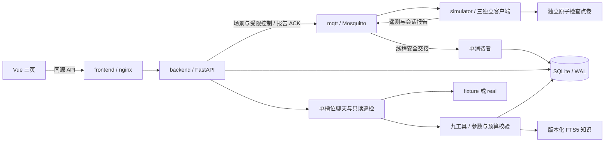

# 实际架构与数据流（v2.0）

单机、三台独立软件设备、一个业务Agent、一个Uvicorn worker。设备控制由页面调用受限HTTP接口；Agent的九工具中只有创建工单可写，授权时才暴露。没有MCP、向量数据库或实体硬件控制。

## 生命周期与迁移

启动依次应用编号SQL迁移、初始化三设备、按摘要导入知识、恢复遗留任务状态、启动消费者及告警/巡检定时器。迁移是唯一建表路径；已执行脚本摘要不可变，显式事务保证DDL失败回滚。v1原业务行保留，新增字段为空，不补造会话。

数据库每连接启用外键、WAL、1000ms busy timeout。网络等待不占用数据库事务。paho网络线程只把消息交给事件循环；每个HTTP/工具事务持有独立AsyncSession，单消费者处理遥测入库。关闭先停止产生新工作的定时器/脚本，再受管理地收尾业务任务、队列与MQTT。

四个Compose服务仅把端口发布在127.0.0.1。backend独占SQLite卷，simulator独占检查点卷，模型配置只传backend。测试使用自己创建的项目、随机端口、卷和MQTT前缀，不能复用开发数据库。

## 遥测、会话和两种时钟

v1与v2分别严格校验。message_id和(device_id, boot_id, seq)双唯一约束区分重复与冲突；重复比较不含后端接收时间。合法旧消息可进历史，但快照只接受严格更新的sample_ts；重复、retained、回放或过期样本不能让设备重新在线。

样本年龄≤10秒且本进程已收到新鲜数据时才data_fresh；最后新鲜接收超过15秒才offline。重启先unknown，旧指标保留时间。会话报告、控制ACK、知识查询均不刷新在线时间。API历史最多24小时/5000行；工具窗口为1—60分钟；统计使用完整窗口，展示分页不改变统计。

DataClock只产生带时区的UTC业务时间；deadline、耗时与模拟计量经过时间分别使用真实单调时钟。评测冻结DataClock不暂停20/3/90+5、控制5/4或功率30+5秒预算。

operations模拟器以整数功率×纳秒累计能量，保留余数后输出整数Wh，避免每次采样舍入丢电量。先持久化检查点再发布；会话报告保存后按1/2/4/30秒限定退避重发，backend提交后才stored ACK。断电重启从最近检查点中断旧会话，未记录区间未知，不按停机时间估算电量。报告不与遥测互相冒充。

## 受限控制与站点预算

场景命令仍使用独立command_id和5秒ACK：normal、overheat、offline；offline只暂停遥测，控制订阅保留。60秒脚本在0/20/40秒经同一场景服务发送命令；取消停止未来步骤，手动场景覆盖留原因，重启不补跑。脚本不占用充电控制generation。

充电控制只支持start_session、stop_session、set_power_limit。后端先在短事务中保存命令，再发布MQTT；匹配device/action/generation/command_id的ACK才applied。ACK后仍须4秒内新鲜匹配遥测验证，否则unconfirmed。start初始限制0W；设置功率仅通过保存的站点计划执行。未知结果不自动重试或回滚，重启pending标interrupted。

功率预览按100W粒度生成equal或priority分配，保存控制指纹和120秒有效期，不发布MQTT。执行时复核会话、限制、预算版本与新鲜度。阶段内并行，先把所有降低操作verified，再允许提升；每次提升使用max(旧限制,未确认目标)计算保守上界。只有所有目标都verified才更新确认预算，PARTIAL保留逐设备结果与旧确认预算。

## 告警、工单与幂等

告警把观测条件、确认状态与恢复状态分开。默认≥60°C触发，严格<55°C连续10秒新鲜样本才恢复；连续样本间隔最多3秒。重复、乱序和断档不推进持续计时。告警保存当时规则版本；修改或禁用规则不能抹掉旧事件或伪造恢复。重启保留活动告警且evaluation未知。

工单OPEN→IN_PROGRESS→RESOLVED→CLOSED，RESOLVED可退回IN_PROGRESS；填写处理说明不等于已恢复。关闭事务重新查询设备新鲜状态及关联告警CLEARED，保存真实样本ID、时间与校验时间。部分唯一索引覆盖全部未关闭状态，同设备同原因最多一单。

新写入的operation_requests在同一事务中记录参数摘要与业务结果。同request_id同路径/动作/参数复用原结果，异内容409；幂等先于忙碌或版本检查。Agent接收锁覆盖“幂等→槽位→run持久化→登记任务”，不包围模型等待。模型建单的上下文由服务器注入，只选本run、本设备的成功只读证据；建单与当前tool_call结果原子提交。

写入超时后停止调度并收尾事务，只按本次内部tool_call_id恢复结果，不能因设备已有旧工单猜测本次成功；无法确认则WRITE_RESULT_UNKNOWN。重启不重放模型或控制。

## 九工具、知识与巡检

八个只读工具：get_device_status、get_device_history、get_fault_guide、get_fleet_overview、search_fault_knowledge、get_charging_sessions、get_device_timeline、get_work_orders。唯一写工具create_work_order需本次显式授权且明确建单意图；Agent没有启停、功率调整、工单迁移、文件、shell或SQL工具。

模型适配器保存完整assistant tool_calls，再按provider_call_id配对回传。内部tool_call_id独立用于数据库和引用；批调用先整体校验再顺序执行。最多6次模型请求（含最终回答）、8次工具调用；单步20/3秒、整轮90秒、清理最多5秒。无隐藏重试或real→fixture回退。成功/失败/超时均留轨迹，usage缺失明确记录。

知识为24篇authored_simulation说明，保留source_id/version/content hash。NFKC与中文单字/双字切分用于FTS5 BM25，查询转义并过滤停用版本和错误型号；top5、每块≤600字、总正文≤3000字。导入/索引事务原子切换，旧版本仍可打开；索引不可用返回明确错误。

最终回答的[KB:source@version#chunk]和[DATA:tool_call_id]仅能指向本run成功工具实际返回的证据；伪造或跨run引用被ANSWER_EVIDENCE_ERROR阻断。引用有效只证明来源关联正确，不替代真人对数值、结论、建议及权限表述的语义复核。

手动巡检强制首个工具为固定窗口的fleet汇总；九工具中写工具始终关闭。fleet在同一UTC锚点和SQLite读取快照内汇总三个设备。巡检与聊天共享唯一运行槽位；默认关闭的周期巡检每30分钟触发，忙时只记skipped_busy，不排队、不补跑。失败报告保留已经成功取得的事实快照，completed不代表回答质量通过。

## 三页面与事件复盘

总览使用fleet聚合接口，详情展示会话、曲线、控制、告警和工单，对话展示run历史、工具轨迹、实际引用及巡检报告。设备查询每2秒、运行状态每1秒，完成一次再调度下一次；离页取消，终态停止。写入前保存request_id及原请求，断网或5xx后显式重试仍复用同一ID。

时间线由真实来源表做只读UNION，按observed_at/type/id稳定排序、带作用域游标，保留晚到received_at。工具事件时间定义为调用开始，不能把单调耗时加到DataClock伪造业务时间。回放只改变查询窗口，不重发命令、不改业务表。来源缺失的历史接收时间保留null。
