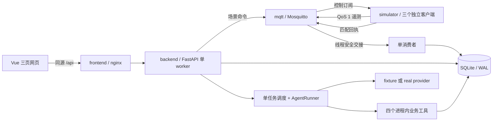

# 实际架构与数据流

本项目是单机、纯软件设备模拟作品。默认 fixture 模式用于工程演示；真实模型配置和效果验收另行进行。只有一个业务 Agent，不包含 MCP 或向量 RAG。

## 消息与当前状态

1. 三台设备每 2 秒发送合成遥测。message_id、boot_id、seq 由模拟器产生；每台独立 client_id。
2. paho 的网络线程只交接消息，数据库会话在应用事件循环中创建。单消费者完成解析、去重、诊断及入库。
3. message_id 和 (device_id, boot_id, seq) 两个唯一约束防止重复；业务字段相同为 duplicate、不同为 conflict。received_at 不参与比较。
4. 历史允许合法乱序样本；当前快照只接受严格更新的 sample_ts。只有新鲜且成为快照的消息更新本进程新鲜接收时间。
5. 样本年龄 ≤10 秒才是新鲜数据；最后新鲜接收后 >15 秒才离线。online 与 data_fresh 是独立字段。重启清空在线依据，保留历史。
6. 事务返回后记录 telemetry_committed，以 message_id 与实际提交后时间关联性能证据。

DataClock 只负责 UTC 业务时间。模型、工具、命令确认和总 deadline 使用真实单调时钟；固定评测数据时间不会暂停超时。

## 场景控制

HTTP POST 返回 pending 与 command_id。Broker 发布成功不表示设备已执行。只有设备/场景/主题/command_id 匹配的回执可以确认 applied；5 秒后转 timed_out，晚到回执单独保存。offline 只暂停遥测，控制订阅仍然保留。重启遗留 pending 命令标记为结果未确认。

## 请求与工单

进程调度锁覆盖“幂等查询→忙碌检查→持久化 run→登记后台任务”。模型等待不持锁。重复 request_id 先于忙碌检查；同内容复用任务，不同内容 409。新任务遇忙 429。

工单从本 run、本设备的成功只读调用选证据，并重新检查原始样本及时间。OFFLINE 还会重算当前状态，恢复后的设备不能凭旧离线结论建单。创建/复用工单及当前工具成功结果在同一 SQLite 事务提交；OPEN 部分唯一索引兜底。复用单也保存本次调用选中的证据。

提交边界超时后取消/等待事务结束，仅按当前内部 tool_call_id 恢复已提交结果。不能靠查到旧 OPEN 工单推断本次写入成功；确认失败返回 WRITE_RESULT_UNKNOWN，停止后续工具。

## 模型协议

real 使用配置的 Chat Completions 协议端点，经 HTTP 模拟测试验证结构，实际 endpoint/model 仍需用户配置后完成真实握手。没有隐藏重试或 fixture 回退。

先保存完整 assistant 响应，验证整批调用后顺序执行，再以 provider_call_id 回传结果。服务器的 tool_call_id 与 provider ID 分开。调用记录有独立执行序号，冻结 DataClock 时也不会按随机 UUID 排序。

六次模型请求包含最终回答，工具上限八次；单步 20/3 秒、整轮 90 秒、清理最多 5 秒。模型输出、工具数据和故障说明不改变工具白名单或授权。工具参数无法传入 context、内部证据编号或任意文件路径。

## 持久化与部署

七表为 devices、telemetry、scenario_commands、agent_runs、tool_calls、work_orders、diagnostic_events。AgentRun 保存协议消息和模型耗时；ToolCall 保存服务器结果、provider ID 与执行序号。

四服务仅发布 127.0.0.1 上的端口；SQLite 独立卷只交给 backend。模型配置只传后端。本机开发库 data/ 与容器 /data 不共用。前端轮询使用完成后再调度的定时器，路由离开取消请求与定时器。
