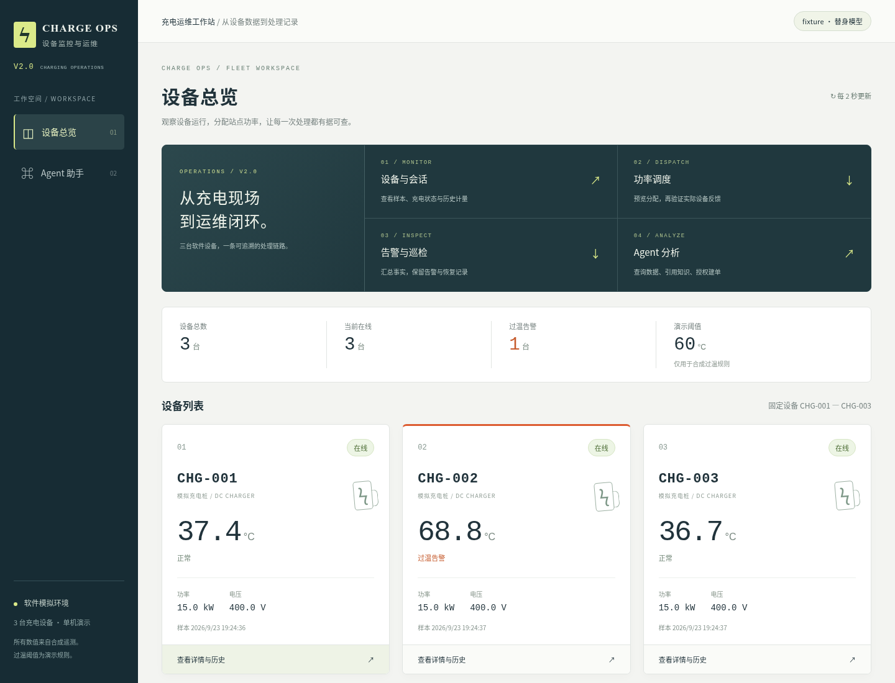

# 当前成果展示

本轮按用户要求调整现有界面：v2.0版本标识、四步功能导览、设备区与操作区层次；保留三个页面及真实API。业务规则与模型提示未改。

## 打开展示

- 总览：http://127.0.0.1:44468/devices
- 2号桩：http://127.0.0.1:44468/devices/CHG-002
- Agent：http://127.0.0.1:44468/agent（在“历史任务”选择过温建单任务）
- 已生成巡检：http://127.0.0.1:44468/agent?report=ddec90ab-2fb8-4775-9ed7-4687c55ae473

这是独立项目 `charge-showcase-20260923`，独立数据卷，只有127.0.0.1可访问。原8080的deploy实例没有更新或停止。展示实例特意保留运行，便于现在打开查看。

## 已实际操作的结果

三台各请求20000W并开始会话；45000W站点计划已VERIFIED，各分配15000W。CHG-002保持模拟过温，其余正常；通过实际工具读取状态/历史/说明，明确授权后生成真实数据库工单；完成一份只读站点巡检。当前保留活动会话、过温场景和OPEN工单供展示，读数会随软件模拟继续变化。

模型为 **fixture替身**，页面有明确标识；这是工程流程演示，不称为真实推理。MQTT、控制反馈、计量、数据库、工单和轨迹均为实际业务链路。此前132例真实模型自动检查及待人工状态保持原记录。

## 截图



- [功率计划](../artifacts/showcase/20260923/02-power-plan.png)
- [设备详情与会话/告警/工单](../artifacts/showcase/20260923/03-device-detail.png)
- [Agent结果和工具轨迹](../artifacts/showcase/20260923/04-agent.png)
- [巡检报告](../artifacts/showcase/20260923/05-patrol.png)
- [实际演示记录](../artifacts/showcase/20260923/demonstration.json)
- [验证与证据相容范围](../artifacts/showcase/20260923/verification.json)

## 验证与限制

前端typecheck/build通过；隔离E2E 7项通过（52.3秒）：两种分辨率布局、充电与功率、响应丢失重试、未确认命令、部分功率计划。演示脚本另验证页内导航、实际建单/巡检及三页无横向溢出，无浏览器脚本错误。实际查看总览及Agent截图。构建保留ECharts包体积提示；Docker Hub元数据请求失败后复用锁文件相同的本地镜像，首次截图定位错误与修正日志均保留。

## 停止或再次启动

从仓库根目录执行，以下仅影响本次演示项目，停止不删除数据卷：

```bash
docker compose --env-file artifacts/showcase/20260923/compose.env -f deploy/compose.yaml stop
docker compose --env-file artifacts/showcase/20260923/compose.env -f deploy/compose.yaml up -d --no-build --wait
```

若要结束业务演示但保留服务，先在CHG-002详情点击“恢复正常”，再分别停止三台会话；等待会话报告和告警恢复。工单的解决/关闭需要实际操作，不自动伪造处理过程。
